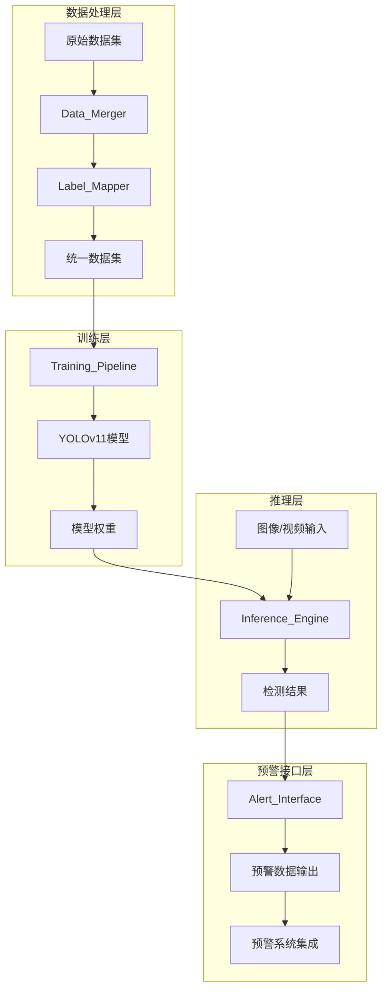

# Design Document

## Overview

本设计文档描述基于YOLOv11的大学生课堂行为预警模型的技术架构和实现方案。系统采用模块化设计，包含数据处理、模型训练、推理引擎和预警接口四大核心模块，便于后期预警功能的扩展和集成。

## Architecture



### 系统架构说明

1. **数据处理层**: 负责多数据集的合并、标签映射和格式统一
2. **训练层**: 基于YOLOv11进行模型训练，支持迁移学习和超参数配置
3. **推理层**: 加载训练好的模型进行实时行为检测
4. **预警接口层**: 将检测结果转换为标准化预警数据，供外部系统调用

## Components and Interfaces

### 1. 类别配置模块 (BehaviorConfig)

```python
class BehaviorConfig:
    """行为类别配置"""
    
    # 统一类别定义
    CLASSES = {
        0: {'name': 'handrise', 'cn_name': '举手', 'type': 'normal', 'alert_level': 0},
        1: {'name': 'read', 'cn_name': '阅读', 'type': 'normal', 'alert_level': 0},
        2: {'name': 'write', 'cn_name': '书写', 'type': 'normal', 'alert_level': 0},
        3: {'name': 'sleep', 'cn_name': '睡觉', 'type': 'warning', 'alert_level': 3},
        4: {'name': 'stand', 'cn_name': '站立', 'type': 'warning', 'alert_level': 1},
        5: {'name': 'using_electronic_devices', 'cn_name': '使用电子设备', 'type': 'warning', 'alert_level': 3},
        6: {'name': 'talk', 'cn_name': '交谈', 'type': 'warning', 'alert_level': 2},
    }
    
    # 数据集标签映射
    LABEL_MAPPING = {
        'student': {
            'handrise': 0, 'read': 1, 'write': 5, 'sleep': 2, 
            'stand': 3, 'using_electronic_devices': 4
        },
        'SCB5-Handrise-Read-write': {
            'hand-raising': 0, 'read': 1, 'write': 2
        },
        'SCB5-Stand': {'stand': 0},
        'SCB5-Talk': {'talk': 0},
    }
    
    def get_class_info(self, class_id: int) -> dict
    def get_alert_level(self, class_id: int) -> int
    def is_warning_behavior(self, class_id: int) -> bool
    def get_class_names(self) -> list[str]
```

### 2. 数据合并模块 (DataMerger)

```python
class DataMerger:
    """数据集合并器"""
    
    def __init__(self, config: BehaviorConfig, output_dir: str)
    
    def scan_datasets(self, dataset_paths: list[str]) -> dict
        """扫描所有数据集，返回图像和标签文件列表"""
    
    def merge_datasets(self, datasets: dict) -> None
        """合并数据集到统一目录"""
    
    def remap_labels(self, label_file: str, source_dataset: str) -> str
        """重映射标签文件中的类别ID"""
    
    def generate_data_yaml(self) -> str
        """生成YOLO格式的data.yaml配置文件"""
    
    def generate_statistics(self) -> dict
        """生成数据集统计报告"""
```

### 3. 训练流水线 (TrainingPipeline)

```python
class TrainingPipeline:
    """YOLOv11训练流水线"""
    
    def __init__(self, model_size: str = 'yolo11m', pretrained: bool = True)
    
    def configure(self, 
                  epochs: int = 100,
                  batch_size: int = 16,
                  img_size: int = 640,
                  lr0: float = 0.01,
                  **kwargs) -> None
        """配置训练超参数"""
    
    def train(self, data_yaml: str, resume: bool = False) -> dict
        """执行训练，返回训练结果"""
    
    def validate(self, weights: str) -> dict
        """在验证集上评估模型"""
    
    def export(self, weights: str, format: str = 'onnx') -> str
        """导出模型为指定格式"""
```

### 4. 推理引擎 (InferenceEngine)

```python
class InferenceEngine:
    """行为检测推理引擎"""
    
    def __init__(self, weights: str, config: BehaviorConfig)
    
    def detect(self, 
               source: Union[str, np.ndarray],
               conf_threshold: float = 0.5,
               iou_threshold: float = 0.45) -> list[Detection]
        """执行检测，返回检测结果列表"""
    
    def detect_video(self, 
                     video_path: str,
                     output_path: str = None,
                     callback: Callable = None) -> VideoResult
        """处理视频，支持回调函数"""
    
    def detect_stream(self, 
                      camera_id: int = 0,
                      callback: Callable = None) -> Generator
        """处理实时视频流"""
```

### 5. 预警接口 (AlertInterface)

```python
@dataclass
class Detection:
    """单个检测结果"""
    bbox: tuple[float, float, float, float]  # x1, y1, x2, y2
    class_id: int
    class_name: str
    confidence: float
    behavior_type: str  # 'normal' or 'warning'
    alert_level: int    # 0-3
    timestamp: float

@dataclass
class AlertResult:
    """预警结果"""
    detections: list[Detection]
    alert_triggered: bool
    alert_summary: dict  # 各级别预警数量统计
    frame_id: int
    timestamp: float

class AlertInterface:
    """预警接口"""
    
    def __init__(self, config: BehaviorConfig)
    
    def process_detections(self, 
                           raw_detections: list,
                           frame_id: int = 0) -> AlertResult
        """处理原始检测结果，生成预警数据"""
    
    def aggregate_alerts(self, 
                         results: list[AlertResult],
                         time_window: float = 5.0) -> dict
        """聚合时间窗口内的预警统计"""
    
    def to_json(self, result: AlertResult) -> str
        """将预警结果序列化为JSON"""
    
    def get_alert_summary(self, result: AlertResult) -> dict
        """获取预警摘要信息"""
```

### 6. 可视化模块 (Visualizer)

```python
class Visualizer:
    """检测结果可视化"""
    
    # 颜色配置
    COLORS = {
        'normal': (0, 255, 0),    # 绿色
        'warning_1': (0, 165, 255),  # 橙色
        'warning_2': (0, 100, 255),  # 深橙色
        'warning_3': (0, 0, 255),    # 红色
    }
    
    def __init__(self, config: BehaviorConfig)
    
    def draw_detections(self, 
                        image: np.ndarray,
                        detections: list[Detection]) -> np.ndarray
        """在图像上绘制检测框和标签"""
    
    def draw_alert_panel(self,
                         image: np.ndarray,
                         alert_result: AlertResult) -> np.ndarray
        """绘制预警统计面板"""
    
    def generate_report(self,
                        video_results: list[AlertResult],
                        output_path: str) -> None
        """生成预警分析报告"""
```

## Data Models

### 数据集目录结构

```
merged_dataset/
├── images/
│   ├── train/
│   ├── val/
│   └── test/
├── labels/
│   ├── train/
│   ├── val/
│   └── test/
├── data.yaml
└── statistics.json
```

### data.yaml 配置格式

```yaml
train: ./images/train
val: ./images/val
test: ./images/test

nc: 7
names: ['handrise', 'read', 'write', 'sleep', 'stand', 'using_electronic_devices', 'talk']

# 预警配置
alert_config:
  normal_classes: [0, 1, 2]
  warning_classes: [3, 4, 5, 6]
  alert_levels:
    0: [0, 1, 2]  # 正常
    1: [4]        # 轻度预警 - stand
    2: [6]        # 中度预警 - talk
    3: [3, 5]     # 严重预警 - sleep, using_electronic_devices
```

### 检测结果JSON格式

```json
{
  "frame_id": 100,
  "timestamp": 1703123456.789,
  "alert_triggered": true,
  "detections": [
    {
      "bbox": [100, 200, 300, 400],
      "class_id": 3,
      "class_name": "sleep",
      "confidence": 0.92,
      "behavior_type": "warning",
      "alert_level": 3
    }
  ],
  "alert_summary": {
    "total_detections": 5,
    "normal_count": 3,
    "warning_count": 2,
    "level_0": 3,
    "level_1": 0,
    "level_2": 1,
    "level_3": 1
  }
}
```


## Correctness Properties

*A property is a characteristic or behavior that should hold true across all valid executions of a system-essentially, a formal statement about what the system should do. Properties serve as the bridge between human-readable specifications and machine-verifiable correctness guarantees.*

### Property 1: 类别配置完整性

*For any* class_id in range [0, 6], the BehaviorConfig SHALL return a valid class info containing name, cn_name, type (normal/warning), and alert_level (0-3), and the type SHALL correctly correspond to the predefined normal classes [0,1,2] and warning classes [3,4,5,6].

**Validates: Requirements 1.1, 1.2**

### Property 2: 检测结果数据结构完整性

*For any* Detection object, it SHALL contain all required fields (bbox, class_id, class_name, confidence, behavior_type, alert_level, timestamp), and behavior_type SHALL be either 'normal' or 'warning', and alert_level SHALL be in range [0, 3].

**Validates: Requirements 1.3, 7.1, 7.2, 7.5**

### Property 3: 标签映射一致性

*For any* label name from any source dataset, if a mapping exists in LABEL_MAPPING, the Label_Mapper SHALL produce a valid unified class_id in range [0, 6], and semantically equivalent labels (e.g., 'hand-raising' and 'handrise') SHALL map to the same class_id.

**Validates: Requirements 1.4, 2.2**

### Property 4: 预警触发逻辑正确性

*For any* AlertResult containing at least one Detection with behavior_type='warning', the alert_triggered field SHALL be true, and the alert_summary SHALL correctly count detections by alert_level.

**Validates: Requirements 7.3, 7.4**

### Property 5: 数据集划分比例

*For any* dataset without existing splits, after Data_Merger performs automatic splitting, the ratio of train:val:test samples SHALL be approximately 8:1:1 (within 5% tolerance), and each split SHALL contain at least one sample of each class present in the original dataset.

**Validates: Requirements 3.2, 3.3**

### Property 6: 教师行为过滤

*For any* label file containing teacher behavior annotations, after Data_Merger processing, the output label file SHALL NOT contain any teacher-related class_ids, and only student behavior class_ids [0-6] SHALL remain.

**Validates: Requirements 2.6**

### Property 7: 可视化颜色映射

*For any* Detection with behavior_type='normal', the Visualizer SHALL use green color (0, 255, 0), and for behavior_type='warning', the color SHALL correspond to alert_level: level 1 → orange, level 2 → deep orange, level 3 → red.

**Validates: Requirements 9.1**

### Property 8: JSON序列化往返一致性

*For any* valid AlertResult object, serializing to JSON via to_json() and then deserializing SHALL produce an equivalent AlertResult with all fields preserved.

**Validates: Requirements 9.4**

### Property 9: 视频统计聚合正确性

*For any* sequence of AlertResults from video processing, the aggregated statistics SHALL correctly sum the counts of each behavior type and alert level across all frames within the specified time window.

**Validates: Requirements 9.3**

## Error Handling

### 数据处理错误

| 错误类型 | 处理策略 | 日志级别 |
|---------|---------|---------|
| 图像文件损坏 | 跳过该样本，记录文件路径 | WARNING |
| 标签文件缺失 | 跳过该样本，记录文件路径 | WARNING |
| 标签格式错误 | 尝试修复，失败则跳过 | WARNING |
| 未知类别ID | 跳过该标注行 | WARNING |
| 目录不存在 | 抛出异常，终止处理 | ERROR |

### 训练错误

| 错误类型 | 处理策略 | 日志级别 |
|---------|---------|---------|
| GPU内存不足 | 自动减半batch_size重试 | WARNING |
| 模型加载失败 | 提示检查权重文件路径 | ERROR |
| 数据加载失败 | 检查data.yaml配置 | ERROR |
| 训练中断 | 保存checkpoint，支持续训 | INFO |

### 推理错误

| 错误类型 | 处理策略 | 日志级别 |
|---------|---------|---------|
| 输入图像无效 | 返回空检测结果 | WARNING |
| 视频流中断 | 尝试重连，超时则退出 | WARNING |
| 模型推理失败 | 记录错误，跳过当前帧 | ERROR |

## Testing Strategy

### 单元测试

使用pytest框架进行单元测试，覆盖以下模块：

1. **BehaviorConfig测试**
   - 测试类别信息获取
   - 测试预警级别映射
   - 测试行为类型判断

2. **Label_Mapper测试**
   - 测试各数据集的标签映射
   - 测试未知标签处理
   - 测试映射配置生成

3. **AlertInterface测试**
   - 测试检测结果处理
   - 测试预警触发逻辑
   - 测试JSON序列化

4. **Visualizer测试**
   - 测试颜色映射
   - 测试边界框绘制

### 属性测试

使用hypothesis库进行属性测试，每个属性测试运行至少100次迭代：

1. **Property 1**: 生成随机class_id，验证配置完整性
2. **Property 2**: 生成随机Detection对象，验证数据结构
3. **Property 3**: 生成随机标签名，验证映射一致性
4. **Property 4**: 生成随机AlertResult，验证预警逻辑
5. **Property 5**: 生成随机数据集，验证划分比例
6. **Property 6**: 生成包含教师行为的标签，验证过滤
7. **Property 7**: 生成随机Detection，验证颜色映射
8. **Property 8**: 生成随机AlertResult，验证JSON往返
9. **Property 9**: 生成随机视频结果序列，验证统计聚合

### 集成测试

1. **端到端数据处理测试**: 从原始数据集到统一数据集的完整流程
2. **模型训练验证测试**: 小规模数据集的快速训练验证
3. **推理流水线测试**: 图像输入到预警输出的完整流程

### 测试配置

```python
# pytest.ini
[pytest]
testpaths = tests
python_files = test_*.py
python_functions = test_*
addopts = -v --tb=short

# hypothesis配置
hypothesis.settings.default.max_examples = 100
hypothesis.settings.default.deadline = None
```
