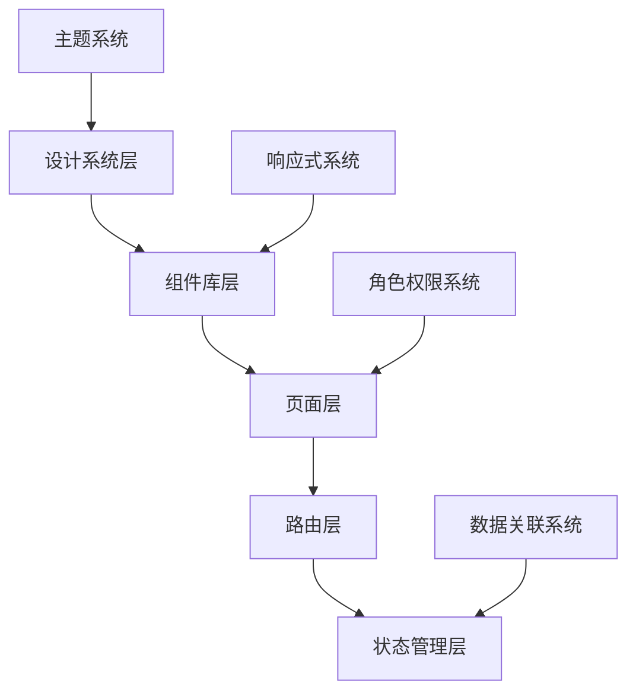

# 系统页面布局优化设计文档

## 概述

本设计文档描述了智慧教育平台整体页面布局优化的技术方案。该优化旨在建立统一的设计语言系统，增强各功能模块间的关联性，丰富不同角色的功能体验，并确保系统在各种设备上的良好表现。

## 架构设计

### 整体架构



### 分层设计

1. **设计系统层**: 定义全局样式变量、主题配置、设计规范
2. **组件库层**: 统一的UI组件，确保跨页面一致性
3. **页面层**: 各功能页面的具体实现
4. **路由层**: 页面间导航和状态传递
5. **状态管理层**: 全局状态和数据关联管理

## 组件和接口设计

### 核心组件设计

#### 1. 统一设计系统 (DesignSystem)

```typescript
interface DesignTokens {
  colors: {
    primary: string
    secondary: string
    success: string
    warning: string
    danger: string
    info: string
    text: {
      primary: string
      secondary: string
      disabled: string
    }
    background: {
      primary: string
      secondary: string
      elevated: string
    }
  }
  typography: {
    fontFamily: string
    fontSize: Record<string, string>
    fontWeight: Record<string, number>
    lineHeight: Record<string, number>
  }
  spacing: Record<string, string>
  borderRadius: Record<string, string>
  shadows: Record<string, string>
  breakpoints: Record<string, string>
}

interface ThemeConfig {
  light: DesignTokens
  dark: DesignTokens
  current: 'light' | 'dark'
}
```

#### 2. 统计卡片组件 (StatCard)

```typescript
interface StatCardProps {
  title: string
  value: string | number
  icon: string
  trend?: {
    value: number
    direction: 'up' | 'down' | 'stable'
  }
  color?: 'primary' | 'success' | 'warning' | 'danger'
  clickable?: boolean
  onClick?: () => void
  loading?: boolean
}

interface StatCardGroup {
  cards: StatCardProps[]
  responsive: boolean
  gutter: number
}
```

#### 3. 页面布局组件 (PageLayout)

```typescript
interface PageLayoutProps {
  title: string
  breadcrumb?: BreadcrumbItem[]
  actions?: ActionButton[]
  filters?: FilterConfig[]
  children: React.ReactNode
  loading?: boolean
  error?: string
}

interface BreadcrumbItem {
  label: string
  path?: string
  active?: boolean
}

interface ActionButton {
  label: string
  type: 'primary' | 'secondary' | 'danger'
  icon?: string
  onClick: () => void
  disabled?: boolean
  loading?: boolean
}
```

#### 4. 数据关联组件 (DataRelation)

```typescript
interface DataRelationProps {
  sourceType: 'student' | 'class' | 'detection' | 'alert'
  sourceId: string
  relations: RelationItem[]
  onNavigate: (type: string, id: string) => void
}

interface RelationItem {
  type: 'detection' | 'alert' | 'portrait' | 'report'
  id: string
  title: string
  summary: string
  timestamp: string
  status?: 'normal' | 'warning' | 'danger'
}
```

### 角色功能接口设计

#### 1. 学生功能接口

```typescript
interface StudentDashboard {
  personalStats: {
    attentionRate: number
    behaviorScore: number
    classRank: number
    weeklyTrend: TrendData[]
  }
  achievements: Achievement[]
  suggestions: Suggestion[]
  resources: LearningResource[]
}

interface Achievement {
  id: string
  title: string
  description: string
  icon: string
  earnedAt: string
  category: 'attention' | 'behavior' | 'improvement'
}

interface Suggestion {
  id: string
  type: 'behavior' | 'learning' | 'health'
  title: string
  content: string
  priority: 'high' | 'medium' | 'low'
  actionable: boolean
}
```

#### 2. 教师功能接口

```typescript
interface TeacherDashboard {
  classOverview: {
    totalStudents: number
    activeStudents: number
    avgAttentionRate: number
    alertCount: number
  }
  realtimeData: RealtimeClassData
  studentList: StudentSummary[]
  interventionHistory: InterventionRecord[]
}

interface RealtimeClassData {
  sessionId: string
  activeDetection: boolean
  currentAttentionRate: number
  behaviorDistribution: Record<string, number>
  alertStudents: string[]
}

interface InterventionRecord {
  id: string
  studentId: string
  alertId: string
  action: string
  result: string
  timestamp: string
  effectiveness: number
}
```

#### 3. 管理员功能接口

```typescript
interface AdminDashboard {
  systemOverview: {
    totalUsers: number
    activeClasses: number
    systemHealth: 'good' | 'warning' | 'critical'
    storageUsage: number
  }
  userManagement: UserManagementData
  systemConfig: SystemConfiguration
  reports: ReportTemplate[]
}

interface UserManagementData {
  users: User[]
  roles: Role[]
  permissions: Permission[]
  auditLog: AuditLogEntry[]
}

interface SystemConfiguration {
  alertRules: AlertRule[]
  detectionSettings: DetectionSettings
  systemPreferences: SystemPreferences
}
```

## 数据模型

### 页面状态模型

```typescript
interface PageState {
  loading: boolean
  error: string | null
  data: any
  filters: Record<string, any>
  pagination: PaginationState
  selection: string[]
}

interface NavigationState {
  currentPath: string
  breadcrumb: BreadcrumbItem[]
  context: Record<string, any>
  history: NavigationHistoryItem[]
}

interface GlobalState {
  user: UserInfo
  theme: ThemeConfig
  notifications: Notification[]
  cache: Record<string, any>
}
```

### 数据关联模型

```typescript
interface DataRelationship {
  sourceType: EntityType
  sourceId: string
  targetType: EntityType
  targetId: string
  relationType: 'one-to-one' | 'one-to-many' | 'many-to-many'
  metadata: Record<string, any>
}

interface EntityType {
  name: 'student' | 'class' | 'detection' | 'alert' | 'report'
  schema: Record<string, any>
  relations: string[]
}
```

## 正确性属性

*属性是一个特征或行为，应该在系统的所有有效执行中保持为真——本质上是关于系统应该做什么的正式声明。属性作为人类可读规范和机器可验证正确性保证之间的桥梁。*

### 设计系统一致性属性

**属性 1: 样式一致性**
*对于任何* 页面和组件，所有使用相同设计令牌的元素应该具有相同的视觉表现
**验证: 需求 1.1, 1.2, 1.4**

**属性 2: 组件行为一致性**
*对于任何* 相同类型的组件，在不同页面中应该具有相同的交互行为和状态表现
**验证: 需求 1.3, 4.2, 4.4**

**属性 3: 图表样式一致性**
*对于任何* 图表组件，在所有页面中应该使用相同的配色方案和样式配置
**验证: 需求 1.5, 4.5**

### 页面导航和数据流转属性

**属性 4: 导航连贯性**
*对于任何* 页面跳转操作，相关的上下文信息和筛选条件应该正确传递到目标页面
**验证: 需求 2.5, 5.1**

**属性 5: 数据关联完整性**
*对于任何* 实体，其相关联的数据应该在所有相关页面中保持一致和完整
**验证: 需求 2.2, 2.4, 5.3**

**属性 6: 跳转功能可用性**
*对于任何* 可点击的数据元素，点击后应该能够正确跳转到相应的详情页面
**验证: 需求 2.1, 3.4, 5.2**

### 响应式设计属性

**属性 7: 断点响应性**
*对于任何* 屏幕尺寸变化，页面布局应该根据预定义的断点正确调整
**验证: 需求 6.1, 6.2, 6.3**

**属性 8: 设备适配性**
*对于任何* 设备方向变化，布局应该自动重新计算并适配新的屏幕尺寸
**验证: 需求 6.4**

**属性 9: 触摸交互优化**
*对于任何* 移动设备上的交互元素，其尺寸应该满足最小触摸目标要求（44px）
**验证: 需求 6.5**

### 性能和用户体验属性

**属性 10: 页面加载性能**
*对于任何* 页面访问，初始渲染时间应该在2秒内完成
**验证: 需求 7.1**

**属性 11: 加载状态显示**
*对于任何* 数据加载过程，应该显示适当的加载状态指示器
**验证: 需求 7.2**

**属性 12: 错误处理完整性**
*对于任何* 数据加载失败的情况，应该显示错误信息和重试选项
**验证: 需求 7.3**

**属性 13: 交互响应性**
*对于任何* 用户交互，界面响应应该在100ms内开始
**验证: 需求 7.4**

### 角色功能完整性属性

**属性 14: 学生功能可用性**
*对于任何* 学生用户，登录后应该能够访问个人仪表板和相关学习功能
**验证: 需求 9.1, 9.2, 9.5**

**属性 15: 个性化建议准确性**
*对于任何* 有行为记录的学生，系统应该提供相应的个性化建议和反馈
**验证: 需求 9.3, 9.4**

**属性 16: 教师功能完整性**
*对于任何* 教师用户，应该能够访问所教班级的完整数据和管理功能
**验证: 需求 10.1, 10.2, 10.3**

**属性 17: 干预记录可追踪性**
*对于任何* 教师的干预操作，应该能够记录并跟踪其效果
**验证: 需求 10.4**

**属性 18: 管理员权限完整性**
*对于任何* 管理员用户，应该能够访问全系统的数据和配置功能
**验证: 需求 11.1, 11.2, 11.3**

**属性 19: 系统监控可见性**
*对于任何* 系统状态变化，管理员应该能够通过监控界面及时发现
**验证: 需求 11.5**

### 角色协作属性

**属性 20: 通知传递完整性**
*对于任何* 重要事件或通知，应该根据事件类型正确通知相应角色
**验证: 需求 12.2, 12.4**

**属性 21: 协作功能可用性**
*对于任何* 需要跨角色协作的场景，相关功能应该可用且数据能够正确传递
**验证: 需求 12.1, 12.3, 12.5**

## 错误处理

### 错误分类和处理策略

1. **网络错误**: 显示重试按钮，支持自动重试机制
2. **权限错误**: 显示权限不足提示，引导用户联系管理员
3. **数据错误**: 显示具体错误信息，提供数据修正建议
4. **系统错误**: 显示通用错误信息，记录详细日志用于调试

### 错误恢复机制

```typescript
interface ErrorRecovery {
  retryStrategy: {
    maxRetries: number
    backoffMultiplier: number
    retryableErrors: string[]
  }
  fallbackData: {
    useCache: boolean
    defaultValues: Record<string, any>
  }
  userNotification: {
    showToast: boolean
    showModal: boolean
    message: string
  }
}
```

## 测试策略

### 双重测试方法

本系统采用单元测试和基于属性的测试相结合的方法：

- **单元测试**: 验证具体示例、边界情况和错误条件
- **基于属性的测试**: 验证所有输入的通用属性

### 基于属性的测试配置

- **测试框架**: 使用 Jest + fast-check 进行属性测试
- **最小迭代次数**: 每个属性测试运行100次迭代
- **测试标签格式**: **Feature: dashboard-layout-optimization, Property {number}: {property_text}**

### 测试覆盖范围

1. **组件一致性测试**: 验证相同组件在不同页面的表现一致性
2. **响应式布局测试**: 验证不同屏幕尺寸下的布局正确性
3. **导航功能测试**: 验证页面跳转和数据传递的正确性
4. **权限控制测试**: 验证不同角色的功能访问权限
5. **性能基准测试**: 验证页面加载和交互响应时间
6. **数据关联测试**: 验证跨模块数据的一致性和完整性

### 测试数据生成策略

```typescript
// 用户角色生成器
const userRoleGenerator = fc.oneof(
  fc.constant('student'),
  fc.constant('teacher'),
  fc.constant('admin')
)

// 屏幕尺寸生成器
const screenSizeGenerator = fc.record({
  width: fc.integer({ min: 320, max: 2560 }),
  height: fc.integer({ min: 568, max: 1440 })
})

// 页面状态生成器
const pageStateGenerator = fc.record({
  loading: fc.boolean(),
  error: fc.option(fc.string()),
  data: fc.anything(),
  filters: fc.dictionary(fc.string(), fc.anything())
})
```

这种测试策略确保系统在各种条件下都能保持正确的行为，同时通过属性测试覆盖大量的输入组合，提高测试的全面性和可靠性。