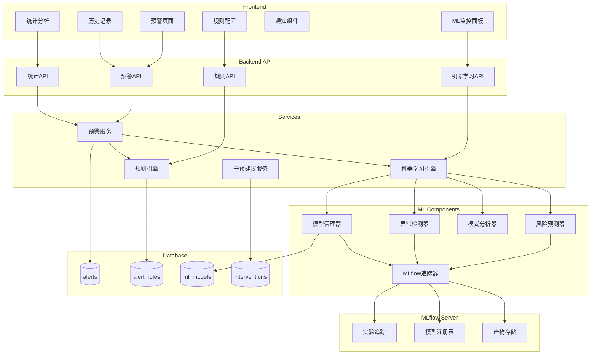

# Design Document: Intelligent Alert System

## Overview

智能预警系统是一个基于机器学习的课堂行为预警平台，旨在将现有的被动检测转变为主动预防。系统通过分析历史行为数据，训练预测模型，实现风险预测、异常检测和个性化干预建议。

核心功能包括：
- 可配置的预警规则引擎
- 实时预警生成与推送
- 历史预警查询与统计分析
- 基于机器学习的风险预测
- 行为模式异常检测
- 个性化干预建议系统

## Architecture



## Components and Interfaces

### 1. Alert Service (backend/services/alert_service.py)

```python
class AlertService:
    """预警服务 - 核心预警生成和管理"""
    
    def generate_alert(
        self,
        detection_result: DetectionResult,
        session_id: int,
        rules: List[AlertRule]
    ) -> List[Alert]:
        """
        根据检测结果和规则生成预警
        
        Args:
            detection_result: 检测结果
            session_id: 会话ID
            rules: 活跃的预警规则列表
            
        Returns:
            生成的预警列表
        """
        pass
    
    def evaluate_rules(
        self,
        behaviors: List[Detection],
        rules: List[AlertRule]
    ) -> List[RuleMatch]:
        """
        评估行为是否匹配规则
        
        Args:
            behaviors: 检测到的行为列表
            rules: 预警规则列表
            
        Returns:
            匹配的规则列表
        """
        pass
    
    def aggregate_alerts(
        self,
        alerts: List[Alert],
        time_window: int = 5
    ) -> List[Alert]:
        """
        聚合时间窗口内的相似预警
        
        Args:
            alerts: 原始预警列表
            time_window: 聚合时间窗口（秒）
            
        Returns:
            聚合后的预警列表
        """
        pass
    
    def get_alert_history(
        self,
        start_date: datetime = None,
        end_date: datetime = None,
        alert_level: int = None,
        behavior_type: str = None,
        page: int = 1,
        page_size: int = 20
    ) -> Tuple[List[Alert], int]:
        """
        查询预警历史
        
        Args:
            start_date: 开始日期
            end_date: 结束日期
            alert_level: 预警级别筛选
            behavior_type: 行为类型筛选
            page: 页码
            page_size: 每页数量
            
        Returns:
            (预警列表, 总数)
        """
        pass
    
    def get_statistics(
        self,
        period: str = 'daily',
        start_date: datetime = None,
        end_date: datetime = None
    ) -> AlertStatistics:
        """
        获取预警统计
        
        Args:
            period: 统计周期 (daily/weekly/monthly)
            start_date: 开始日期
            end_date: 结束日期
            
        Returns:
            预警统计数据
        """
        pass
```

### 2. Rule Engine (backend/services/rule_engine.py)

```python
class RuleEngine:
    """规则引擎 - 管理和评估预警规则"""
    
    def create_rule(self, rule: AlertRuleCreate) -> AlertRule:
        """创建预警规则"""
        pass
    
    def update_rule(self, rule_id: int, rule: AlertRuleUpdate) -> AlertRule:
        """更新预警规则"""
        pass
    
    def delete_rule(self, rule_id: int) -> bool:
        """删除预警规则"""
        pass
    
    def get_active_rules(self) -> List[AlertRule]:
        """获取所有活跃规则"""
        pass
    
    def evaluate(
        self,
        behaviors: List[Detection],
        context: EvaluationContext
    ) -> List[RuleMatch]:
        """
        评估行为是否触发规则
        
        Args:
            behaviors: 行为列表
            context: 评估上下文（包含历史数据）
            
        Returns:
            触发的规则匹配列表
        """
        pass
```

### 3. ML Engine (backend/services/ml_engine.py)

```python
class MLEngine:
    """机器学习引擎 - 风险预测和异常检测"""
    
    def __init__(self):
        self.risk_predictor = RiskPredictor()
        self.anomaly_detector = AnomalyDetector()
        self.pattern_analyzer = PatternAnalyzer()
        self.model_manager = ModelManager()
    
    def train_risk_model(
        self,
        training_data: pd.DataFrame
    ) -> ModelTrainingResult:
        """
        训练风险预测模型
        
        Args:
            training_data: 训练数据
            
        Returns:
            训练结果（包含模型ID和性能指标）
        """
        pass
    
    def predict_risk(
        self,
        features: np.ndarray
    ) -> RiskPrediction:
        """
        预测风险分数
        
        Args:
            features: 特征向量
            
        Returns:
            风险预测结果
        """
        pass
    
    def detect_anomaly(
        self,
        session_data: SessionData
    ) -> AnomalyResult:
        """
        检测行为异常
        
        Args:
            session_data: 会话数据
            
        Returns:
            异常检测结果
        """
        pass
    
    def analyze_patterns(
        self,
        behavior_sequence: List[Detection]
    ) -> PatternAnalysisResult:
        """
        分析行为模式
        
        Args:
            behavior_sequence: 行为序列
            
        Returns:
            模式分析结果
        """
        pass
```

### 4. Risk Predictor (backend/ml/risk_predictor.py)

```python
class RiskPredictor:
    """风险预测器 - 基于历史数据预测行为风险"""
    
    def __init__(self, model_path: str = None):
        self.model = None
        self.scaler = StandardScaler()
        self.feature_names = []
        self.mlflow_tracking = MLflowTracker()
    
    def extract_features(
        self,
        session_history: List[SessionData]
    ) -> np.ndarray:
        """
        从会话历史提取特征
        
        Features:
        - warning_ratio: 预警行为占比
        - behavior_diversity: 行为多样性
        - peak_warning_count: 峰值预警数
        - avg_confidence: 平均置信度
        - session_duration: 会话时长
        - time_of_day: 时间段特征
        """
        pass
    
    def train(
        self,
        X: np.ndarray,
        y: np.ndarray
    ) -> Dict[str, float]:
        """
        训练风险预测模型
        
        使用 RandomForestClassifier 进行训练
        训练过程通过MLflow进行监控和记录
        
        Returns:
            性能指标字典
        """
        pass
    
    def predict(
        self,
        features: np.ndarray
    ) -> Tuple[np.ndarray, np.ndarray]:
        """
        预测风险
        
        Returns:
            (风险标签, 置信度分数)
        """
        pass
```

### 4.1 MLflow Tracker (backend/ml/mlflow_tracker.py)

```python
class MLflowTracker:
    """MLflow追踪器 - 监控机器学习实验和模型"""
    
    def __init__(self, tracking_uri: str = None, experiment_name: str = "alert_ml"):
        """
        初始化MLflow追踪器
        
        Args:
            tracking_uri: MLflow服务器地址，默认使用本地
            experiment_name: 实验名称
        """
        self.tracking_uri = tracking_uri or "runs/mlflow"
        self.experiment_name = experiment_name
        mlflow.set_tracking_uri(self.tracking_uri)
        mlflow.set_experiment(self.experiment_name)
    
    def start_run(
        self,
        run_name: str,
        tags: Dict[str, str] = None
    ) -> str:
        """
        开始一个新的MLflow运行
        
        Args:
            run_name: 运行名称
            tags: 运行标签
            
        Returns:
            run_id
        """
        pass
    
    def log_params(self, params: Dict[str, Any]) -> None:
        """
        记录模型参数
        
        Args:
            params: 参数字典，如 {
                'n_estimators': 100,
                'max_depth': 10,
                'min_samples_split': 2
            }
        """
        pass
    
    def log_metrics(
        self,
        metrics: Dict[str, float],
        step: int = None
    ) -> None:
        """
        记录性能指标
        
        Args:
            metrics: 指标字典，如 {
                'accuracy': 0.85,
                'precision': 0.82,
                'recall': 0.88,
                'f1_score': 0.85,
                'auc_roc': 0.91
            }
            step: 步骤编号（用于训练过程中的指标）
        """
        pass
    
    def log_model(
        self,
        model: Any,
        artifact_path: str,
        registered_model_name: str = None
    ) -> str:
        """
        记录并注册模型
        
        Args:
            model: 训练好的模型
            artifact_path: 模型存储路径
            registered_model_name: 注册的模型名称
            
        Returns:
            模型URI
        """
        pass
    
    def log_artifacts(
        self,
        local_dir: str,
        artifact_path: str = None
    ) -> None:
        """
        记录训练产物（如特征重要性图、混淆矩阵等）
        
        Args:
            local_dir: 本地目录
            artifact_path: 存储路径
        """
        pass
    
    def log_dataset(
        self,
        dataset: pd.DataFrame,
        name: str,
        context: str = "training"
    ) -> None:
        """
        记录数据集信息
        
        Args:
            dataset: 数据集
            name: 数据集名称
            context: 上下文（training/validation/test）
        """
        pass
    
    def end_run(self, status: str = "FINISHED") -> None:
        """
        结束当前运行
        
        Args:
            status: 运行状态 (FINISHED/FAILED/KILLED)
        """
        pass
    
    def get_best_model(
        self,
        metric: str = "f1_score",
        ascending: bool = False
    ) -> Dict[str, Any]:
        """
        获取最佳模型
        
        Args:
            metric: 评估指标
            ascending: 是否升序排列
            
        Returns:
            最佳模型信息
        """
        pass
    
    def compare_runs(
        self,
        run_ids: List[str],
        metrics: List[str]
    ) -> pd.DataFrame:
        """
        比较多个运行的性能
        
        Args:
            run_ids: 运行ID列表
            metrics: 要比较的指标列表
            
        Returns:
            比较结果DataFrame
        """
        pass
    
    def load_model(
        self,
        model_uri: str
    ) -> Any:
        """
        加载已注册的模型
        
        Args:
            model_uri: 模型URI，如 "models:/risk_predictor/Production"
            
        Returns:
            加载的模型
        """
        pass
```

### 5. Anomaly Detector (backend/ml/anomaly_detector.py)

```python
class AnomalyDetector:
    """异常检测器 - 识别异常行为模式"""
    
    def __init__(self):
        self.isolation_forest = IsolationForest(
            contamination=0.1,
            random_state=42
        )
        self.baseline_stats = None
    
    def fit_baseline(
        self,
        historical_data: pd.DataFrame
    ) -> None:
        """
        拟合基线统计
        
        Args:
            historical_data: 历史行为数据
        """
        pass
    
    def calculate_anomaly_score(
        self,
        session_features: np.ndarray
    ) -> float:
        """
        计算异常分数
        
        Args:
            session_features: 会话特征
            
        Returns:
            异常分数 (0-1, 越高越异常)
        """
        pass
    
    def detect(
        self,
        current_data: SessionData,
        threshold: float = 0.7
    ) -> AnomalyResult:
        """
        检测异常
        
        Args:
            current_data: 当前会话数据
            threshold: 异常阈值
            
        Returns:
            异常检测结果
        """
        pass
```

### 6. Intervention Suggester (backend/services/intervention_service.py)

```python
class InterventionService:
    """干预建议服务 - 提供个性化干预建议"""
    
    INTERVENTION_TEMPLATES = {
        'sleep': [
            {'action': '轻声提醒', 'effectiveness': 0.7},
            {'action': '走近学生位置', 'effectiveness': 0.8},
            {'action': '课间单独沟通', 'effectiveness': 0.9},
        ],
        'talk': [
            {'action': '眼神示意', 'effectiveness': 0.6},
            {'action': '点名提问', 'effectiveness': 0.8},
            {'action': '调整座位', 'effectiveness': 0.85},
        ],
        'using_electronic_devices': [
            {'action': '提醒收起设备', 'effectiveness': 0.75},
            {'action': '暂时收管设备', 'effectiveness': 0.9},
        ],
    }
    
    def get_suggestions(
        self,
        alert: Alert,
        history: List[InterventionRecord] = None
    ) -> List[InterventionSuggestion]:
        """
        获取干预建议
        
        Args:
            alert: 预警信息
            history: 历史干预记录
            
        Returns:
            排序后的干预建议列表
        """
        pass
    
    def record_outcome(
        self,
        intervention_id: int,
        outcome: str,
        effectiveness_rating: int
    ) -> None:
        """
        记录干预结果
        
        Args:
            intervention_id: 干预记录ID
            outcome: 结果描述
            effectiveness_rating: 有效性评分 (1-5)
        """
        pass
    
    def update_effectiveness(
        self,
        behavior_type: str,
        action: str,
        new_rating: float
    ) -> None:
        """
        更新干预有效性
        
        基于历史记录更新建议的有效性分数
        """
        pass
```

## Data Models

### Alert Model

```python
@dataclass
class Alert:
    """预警数据模型"""
    alert_id: int
    session_id: int
    alert_level: int  # 0-3: 正常、轻度、中度、严重
    alert_type: str  # rule_based, ml_predicted, anomaly_detected
    behavior_type: str
    behavior_count: int
    confidence: float
    location_info: Dict[str, Any]  # bbox信息
    triggered_rules: List[int]
    risk_score: Optional[float]
    anomaly_score: Optional[float]
    suggestions: List[str]
    created_at: datetime
    is_read: bool = False
    
    def to_dict(self) -> Dict[str, Any]:
        return asdict(self)
```

### Alert Rule Model

```python
@dataclass
class AlertRule:
    """预警规则数据模型"""
    rule_id: int
    name: str
    description: str
    rule_type: str  # frequency, duration, combination, threshold
    conditions: Dict[str, Any]
    """
    conditions 示例:
    {
        "behavior_type": "sleep",
        "threshold": 3,  # 触发阈值
        "time_window": 60,  # 时间窗口（秒）
        "min_confidence": 0.5
    }
    """
    alert_level: int
    is_active: bool
    created_by: int
    created_at: datetime
    updated_at: datetime
```

### ML Model Metadata

```python
@dataclass
class MLModelMetadata:
    """机器学习模型元数据"""
    model_id: int
    model_type: str  # risk_predictor, anomaly_detector
    version: str
    training_date: datetime
    training_samples: int
    metrics: Dict[str, float]  # accuracy, precision, recall, f1
    model_path: str
    mlflow_run_id: str  # MLflow运行ID
    mlflow_model_uri: str  # MLflow模型URI
    is_active: bool
    created_at: datetime


@dataclass
class MLflowExperimentInfo:
    """MLflow实验信息"""
    experiment_id: str
    experiment_name: str
    artifact_location: str
    lifecycle_stage: str
    tags: Dict[str, str]


@dataclass
class MLflowRunInfo:
    """MLflow运行信息"""
    run_id: str
    run_name: str
    experiment_id: str
    status: str  # RUNNING, FINISHED, FAILED, KILLED
    start_time: datetime
    end_time: Optional[datetime]
    params: Dict[str, Any]
    metrics: Dict[str, float]
    tags: Dict[str, str]
    artifacts: List[str]
```

### Database Schema

```sql
-- 预警表
CREATE TABLE alerts (
    alert_id INT PRIMARY KEY AUTO_INCREMENT,
    session_id INT NOT NULL,
    alert_level INT NOT NULL DEFAULT 0,
    alert_type VARCHAR(50) NOT NULL,
    behavior_type VARCHAR(50) NOT NULL,
    behavior_count INT DEFAULT 1,
    confidence FLOAT,
    location_info JSON,
    triggered_rules JSON,
    risk_score FLOAT,
    anomaly_score FLOAT,
    suggestions JSON,
    is_read BOOLEAN DEFAULT FALSE,
    created_at TIMESTAMP DEFAULT CURRENT_TIMESTAMP,
    FOREIGN KEY (session_id) REFERENCES detection_sessions(session_id) ON DELETE CASCADE,
    INDEX idx_session (session_id),
    INDEX idx_level (alert_level),
    INDEX idx_created (created_at)
);

-- 预警规则表
CREATE TABLE alert_rules (
    rule_id INT PRIMARY KEY AUTO_INCREMENT,
    name VARCHAR(100) NOT NULL,
    description TEXT,
    rule_type VARCHAR(50) NOT NULL,
    conditions JSON NOT NULL,
    alert_level INT NOT NULL DEFAULT 1,
    is_active BOOLEAN DEFAULT TRUE,
    created_by INT,
    created_at TIMESTAMP DEFAULT CURRENT_TIMESTAMP,
    updated_at TIMESTAMP DEFAULT CURRENT_TIMESTAMP ON UPDATE CURRENT_TIMESTAMP,
    FOREIGN KEY (created_by) REFERENCES users(user_id) ON DELETE SET NULL
);

-- 机器学习模型表
CREATE TABLE ml_models (
    model_id INT PRIMARY KEY AUTO_INCREMENT,
    model_type VARCHAR(50) NOT NULL,
    version VARCHAR(20) NOT NULL,
    training_date TIMESTAMP,
    training_samples INT,
    metrics JSON,
    model_path VARCHAR(255),
    mlflow_run_id VARCHAR(100),
    mlflow_model_uri VARCHAR(255),
    is_active BOOLEAN DEFAULT FALSE,
    created_at TIMESTAMP DEFAULT CURRENT_TIMESTAMP,
    INDEX idx_type_active (model_type, is_active),
    INDEX idx_mlflow_run (mlflow_run_id)
);

-- MLflow实验记录表（用于本地缓存）
CREATE TABLE mlflow_experiments (
    experiment_id VARCHAR(100) PRIMARY KEY,
    experiment_name VARCHAR(255) NOT NULL,
    artifact_location VARCHAR(500),
    lifecycle_stage VARCHAR(50),
    tags JSON,
    created_at TIMESTAMP DEFAULT CURRENT_TIMESTAMP,
    updated_at TIMESTAMP DEFAULT CURRENT_TIMESTAMP ON UPDATE CURRENT_TIMESTAMP
);

-- MLflow运行记录表（用于本地缓存和快速查询）
CREATE TABLE mlflow_runs (
    run_id VARCHAR(100) PRIMARY KEY,
    run_name VARCHAR(255),
    experiment_id VARCHAR(100),
    status VARCHAR(50),
    start_time TIMESTAMP,
    end_time TIMESTAMP,
    params JSON,
    metrics JSON,
    tags JSON,
    created_at TIMESTAMP DEFAULT CURRENT_TIMESTAMP,
    FOREIGN KEY (experiment_id) REFERENCES mlflow_experiments(experiment_id) ON DELETE CASCADE,
    INDEX idx_experiment (experiment_id),
    INDEX idx_status (status)
);

-- 干预记录表
CREATE TABLE interventions (
    intervention_id INT PRIMARY KEY AUTO_INCREMENT,
    alert_id INT NOT NULL,
    action_taken VARCHAR(255),
    outcome TEXT,
    effectiveness_rating INT,
    recorded_by INT,
    created_at TIMESTAMP DEFAULT CURRENT_TIMESTAMP,
    FOREIGN KEY (alert_id) REFERENCES alerts(alert_id) ON DELETE CASCADE,
    FOREIGN KEY (recorded_by) REFERENCES users(user_id) ON DELETE SET NULL
);

-- 用户通知偏好表
CREATE TABLE notification_preferences (
    preference_id INT PRIMARY KEY AUTO_INCREMENT,
    user_id INT NOT NULL UNIQUE,
    alert_level_0 BOOLEAN DEFAULT FALSE,
    alert_level_1 BOOLEAN DEFAULT TRUE,
    alert_level_2 BOOLEAN DEFAULT TRUE,
    alert_level_3 BOOLEAN DEFAULT TRUE,
    sound_enabled BOOLEAN DEFAULT TRUE,
    created_at TIMESTAMP DEFAULT CURRENT_TIMESTAMP,
    updated_at TIMESTAMP DEFAULT CURRENT_TIMESTAMP ON UPDATE CURRENT_TIMESTAMP,
    FOREIGN KEY (user_id) REFERENCES users(user_id) ON DELETE CASCADE
);
```

## Correctness Properties

*A property is a characteristic or behavior that should hold true across all valid executions of a system-essentially, a formal statement about what the system should do. Properties serve as the bridge between human-readable specifications and machine-verifiable correctness guarantees.*

### Property 1: Alert Rule Validation Round-Trip

*For any* valid alert rule configuration, creating the rule and then retrieving it SHALL produce an equivalent rule object with all fields preserved.

**Validates: Requirements 1.2, 1.3**

### Property 2: Alert Level Classification Bounds

*For any* generated alert, the alert_level SHALL be one of the four valid values: 0 (normal), 1 (mild), 2 (moderate), or 3 (severe).

**Validates: Requirements 2.2**

### Property 3: Alert Aggregation Preserves Information

*For any* set of alerts within a time window, aggregating them SHALL produce a composite alert that contains all unique behavior types and the maximum alert level from the original set.

**Validates: Requirements 2.3**

### Property 4: Alert Data Completeness

*For any* generated and persisted alert, the alert SHALL contain all required fields: behavior_type, location_info (bbox), confidence score, timestamp, and alert_level.

**Validates: Requirements 2.4, 2.5, 3.1, 9.2**

### Property 5: History Filter Correctness

*For any* alert history query with filters, all returned alerts SHALL satisfy all specified filter conditions (date range, alert level, behavior type).

**Validates: Requirements 3.2**

### Property 6: Pagination Consistency

*For any* paginated query, the union of all pages SHALL equal the complete result set, and each page SHALL contain at most page_size items.

**Validates: Requirements 3.3**

### Property 7: Trend Calculation Correctness

*For any* two consecutive periods, the trend percentage SHALL equal ((current - previous) / previous) * 100 when previous > 0.

**Validates: Requirements 3.4**

### Property 8: Statistics Distribution Sum

*For any* statistics calculation, the sum of alerts across all levels/types SHALL equal the total alert count for that period.

**Validates: Requirements 4.1, 4.2**

### Property 9: Peak Identification Correctness

*For any* identified peak time or behavior type, no other time/type in the same period SHALL have a higher count.

**Validates: Requirements 4.3**

### Property 10: Risk Score Bounds

*For any* risk prediction, the confidence score SHALL be a float value between 0.0 and 1.0 inclusive.

**Validates: Requirements 5.4**

### Property 11: Minimum Data Threshold

*For any* risk prediction request with fewer than 100 detection sessions, the system SHALL return an error indicating insufficient data rather than a prediction.

**Validates: Requirements 5.2, 5.6**

### Property 12: Anomaly Score Bounds

*For any* anomaly detection, the anomaly score SHALL be a float value between 0.0 and 1.0 inclusive.

**Validates: Requirements 6.3**

### Property 13: Anomaly Alert Threshold

*For any* session with anomaly score exceeding the configured threshold, the system SHALL generate a pattern-based alert.

**Validates: Requirements 6.4**

### Property 14: Intervention Suggestion Ranking

*For any* set of intervention suggestions, they SHALL be sorted in descending order by predicted effectiveness score.

**Validates: Requirements 7.3**

### Property 15: Intervention Outcome Persistence

*For any* recorded intervention outcome, retrieving the intervention record SHALL return the same outcome and effectiveness rating.

**Validates: Requirements 7.4**

### Property 16: Notification Preference Persistence

*For any* user notification preference update, retrieving the preferences SHALL return the updated values.

**Validates: Requirements 8.3**

### Property 17: Session Summary Accuracy

*For any* detection session, the alert summary SHALL contain counts that match the actual number of alerts generated during that session.

**Validates: Requirements 8.5**

### Property 18: Data Retention Policy

*For any* data cleanup operation with a retention period, all alerts older than the retention period SHALL be removed, and all alerts within the retention period SHALL be preserved.

**Validates: Requirements 9.3**

### Property 19: Referential Integrity

*For any* alert in the database, its session_id SHALL reference an existing detection session.

**Validates: Requirements 9.5**

### Property 20: Model Version Tracking

*For any* trained model, the system SHALL store and retrieve the correct version, training date, performance metrics, and MLflow run ID.

**Validates: Requirements 10.1, 10.3**

### Property 21: MLflow Run Consistency

*For any* MLflow training run, the logged parameters, metrics, and artifacts SHALL be retrievable using the run_id.

**Validates: Requirements 10.1**

### Property 22: MLflow Model Registry

*For any* registered model in MLflow, the model SHALL be loadable using its model URI and produce predictions consistent with the original model.

**Validates: Requirements 10.5**

### Property 23: MLflow Metrics Logging

*For any* model training session, all performance metrics (accuracy, precision, recall, f1_score, auc_roc) SHALL be logged to MLflow and match the locally calculated values.

**Validates: Requirements 10.3**

## Error Handling

### Input Validation Errors

| Error Code | Description | Response |
|------------|-------------|----------|
| INVALID_RULE_CONFIG | 规则配置无效 | 400 Bad Request with validation details |
| INVALID_DATE_RANGE | 日期范围无效 | 400 Bad Request |
| INVALID_ALERT_LEVEL | 预警级别无效 | 400 Bad Request |
| INVALID_PAGE_PARAMS | 分页参数无效 | 400 Bad Request |

### ML Engine Errors

| Error Code | Description | Response |
|------------|-------------|----------|
| INSUFFICIENT_DATA | 训练数据不足 | 400 Bad Request with data requirements |
| MODEL_NOT_FOUND | 模型不存在 | 404 Not Found |
| MODEL_LOAD_FAILED | 模型加载失败 | 500 Internal Server Error |
| PREDICTION_FAILED | 预测失败 | 500 Internal Server Error |

### MLflow Errors

| Error Code | Description | Response |
|------------|-------------|----------|
| MLFLOW_CONNECTION_ERROR | MLflow服务连接失败 | 503 Service Unavailable |
| MLFLOW_RUN_NOT_FOUND | MLflow运行不存在 | 404 Not Found |
| MLFLOW_MODEL_REGISTRY_ERROR | 模型注册失败 | 500 Internal Server Error |
| MLFLOW_ARTIFACT_ERROR | 产物存储/读取失败 | 500 Internal Server Error |

### Database Errors

| Error Code | Description | Response |
|------------|-------------|----------|
| DB_CONNECTION_ERROR | 数据库连接失败 | 503 Service Unavailable |
| INTEGRITY_ERROR | 数据完整性错误 | 500 Internal Server Error |
| QUERY_TIMEOUT | 查询超时 | 504 Gateway Timeout |

## Testing Strategy

### Unit Tests

单元测试覆盖各个组件的核心功能：

1. **AlertService Tests**
   - 测试预警生成逻辑
   - 测试预警聚合逻辑
   - 测试历史查询和筛选

2. **RuleEngine Tests**
   - 测试规则CRUD操作
   - 测试规则评估逻辑
   - 测试各类规则类型

3. **MLEngine Tests**
   - 测试特征提取
   - 测试模型训练和预测
   - 测试异常检测

4. **MLflowTracker Tests**
   - 测试实验创建和管理
   - 测试参数和指标记录
   - 测试模型注册和加载
   - 测试产物存储和检索

5. **InterventionService Tests**
   - 测试建议生成
   - 测试结果记录
   - 测试有效性更新

### Property-Based Tests

使用 Hypothesis 库进行属性测试，每个测试运行至少100次迭代：

```python
# 测试框架配置
import hypothesis
from hypothesis import given, strategies as st, settings

@settings(max_examples=100)
```

属性测试覆盖设计文档中定义的所有正确性属性：

1. **Property 1**: Alert rule round-trip consistency
2. **Property 2**: Alert level bounds validation
3. **Property 3**: Alert aggregation information preservation
4. **Property 4**: Alert data completeness
5. **Property 5**: History filter correctness
6. **Property 6**: Pagination consistency
7. **Property 7**: Trend calculation correctness
8. **Property 8**: Statistics distribution sum
9. **Property 9**: Peak identification correctness
10. **Property 10**: Risk score bounds
11. **Property 11**: Minimum data threshold
12. **Property 12**: Anomaly score bounds
13. **Property 13**: Anomaly alert threshold
14. **Property 14**: Intervention suggestion ranking
15. **Property 15**: Intervention outcome persistence
16. **Property 16**: Notification preference persistence
17. **Property 17**: Session summary accuracy
18. **Property 18**: Data retention policy
19. **Property 19**: Referential integrity
20. **Property 20**: Model version tracking with MLflow
21. **Property 21**: MLflow run consistency
22. **Property 22**: MLflow model registry
23. **Property 23**: MLflow metrics logging

### Integration Tests

集成测试验证组件间的交互：

1. **Detection → Alert Pipeline**
   - 验证检测结果正确触发预警
   - 验证预警正确持久化

2. **ML Training → Prediction Pipeline**
   - 验证模型训练和部署流程
   - 验证预测结果正确性
   - 验证MLflow记录完整性

3. **MLflow Integration Tests**
   - 验证训练过程正确记录到MLflow
   - 验证模型注册和版本管理
   - 验证模型加载和回滚功能

4. **Alert → Notification Pipeline**
   - 验证预警正确推送到前端
   - 验证通知偏好正确应用
