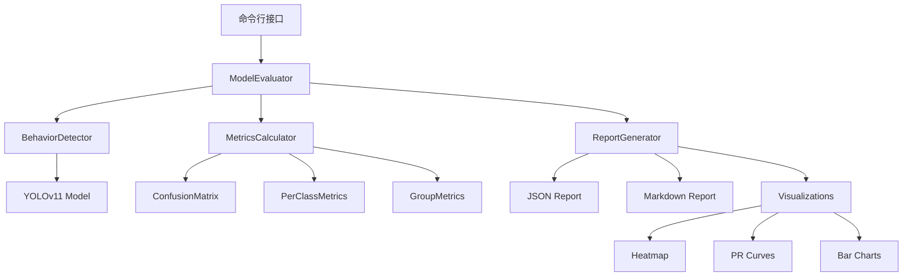

# Design Document: Model Evaluation

## Overview

本设计文档描述了课堂行为检测模型评估系统的架构和实现细节。该系统基于 YOLOv11 模型，提供全面的模型性能评估功能，包括指标计算、混淆矩阵分析、可视化输出和报告生成。

## Architecture

系统采用模块化设计，主要包含以下组件：



## Components and Interfaces

### 1. ModelEvaluator (主评估器)

```python
class ModelEvaluator:
    """模型评估器主类"""
    
    def __init__(self, weights_path: str, device: str = 'auto'):
        """
        初始化评估器
        
        Args:
            weights_path: 模型权重文件路径
            device: 运行设备 ('auto', 'cpu', '0', '0,1' 等)
        """
        pass
    
    def load_model(self) -> bool:
        """加载并验证模型"""
        pass
    
    def evaluate(
        self,
        data_yaml: str,
        split: str = 'val',
        conf: float = 0.25,
        iou: float = 0.45,
        verbose: bool = False
    ) -> EvaluationResult:
        """
        执行模型评估
        
        Args:
            data_yaml: 数据集配置文件路径
            split: 数据集分割 ('val' 或 'test')
            conf: 置信度阈值
            iou: NMS IoU 阈值
            verbose: 是否输出详细信息
            
        Returns:
            EvaluationResult 包含所有评估结果
        """
        pass
```

### 2. MetricsCalculator (指标计算器)

```python
class MetricsCalculator:
    """评估指标计算器"""
    
    def __init__(self, num_classes: int = 7):
        """初始化计算器"""
        pass
    
    def compute_overall_metrics(
        self,
        predictions: List[Detection],
        ground_truths: List[Detection]
    ) -> OverallMetrics:
        """计算整体指标 (mAP50, mAP50-95, precision, recall, F1)"""
        pass
    
    def compute_per_class_metrics(
        self,
        predictions: List[Detection],
        ground_truths: List[Detection]
    ) -> Dict[int, ClassMetrics]:
        """计算每个类别的指标"""
        pass
    
    def compute_group_metrics(
        self,
        per_class_metrics: Dict[int, ClassMetrics]
    ) -> GroupMetrics:
        """计算行为组指标 (正常行为 vs 预警行为)"""
        pass
    
    def generate_confusion_matrix(
        self,
        predictions: List[Detection],
        ground_truths: List[Detection],
        normalize: bool = True
    ) -> np.ndarray:
        """生成混淆矩阵"""
        pass
    
    def analyze_confusion(
        self,
        confusion_matrix: np.ndarray,
        top_k: int = 3
    ) -> List[ConfusedPair]:
        """分析最容易混淆的类别对"""
        pass
```

### 3. ReportGenerator (报告生成器)

```python
class ReportGenerator:
    """评估报告生成器"""
    
    def __init__(self, output_dir: str, dpi: int = 150):
        """
        初始化报告生成器
        
        Args:
            output_dir: 输出目录
            dpi: 图像 DPI
        """
        pass
    
    def generate_json_report(
        self,
        result: EvaluationResult,
        output_path: str
    ) -> str:
        """生成 JSON 格式报告"""
        pass
    
    def generate_markdown_report(
        self,
        result: EvaluationResult,
        output_path: str
    ) -> str:
        """生成 Markdown 格式报告"""
        pass
    
    def generate_confusion_heatmap(
        self,
        confusion_matrix: np.ndarray,
        class_names: List[str],
        output_path: str
    ) -> str:
        """生成混淆矩阵热力图"""
        pass
    
    def generate_pr_curves(
        self,
        per_class_metrics: Dict[int, ClassMetrics],
        class_names: List[str],
        output_path: str
    ) -> str:
        """生成 PR 曲线图"""
        pass
    
    def generate_metrics_bar_chart(
        self,
        per_class_metrics: Dict[int, ClassMetrics],
        class_names: List[str],
        output_path: str
    ) -> str:
        """生成指标对比柱状图"""
        pass
```

## Data Models

```python
from dataclasses import dataclass
from typing import List, Dict, Optional
from datetime import datetime

@dataclass
class Detection:
    """检测结果"""
    class_id: int
    confidence: float
    bbox: List[float]  # [x1, y1, x2, y2]
    image_id: str

@dataclass
class ClassMetrics:
    """单个类别的指标"""
    class_id: int
    class_name: str
    precision: float
    recall: float
    f1_score: float
    ap50: float
    ap50_95: float
    support: int  # 该类别的样本数

@dataclass
class OverallMetrics:
    """整体指标"""
    mAP50: float
    mAP50_95: float
    precision: float
    recall: float
    f1_score: float
    total_images: int
    total_predictions: int
    total_ground_truths: int

@dataclass
class GroupMetrics:
    """行为组指标"""
    normal_precision: float
    normal_recall: float
    normal_f1: float
    warning_precision: float
    warning_recall: float
    warning_f1: float
    warning_recall_critical: bool  # 预警行为召回率是否低于0.5

@dataclass
class ConfusedPair:
    """混淆类别对"""
    class_a: int
    class_b: int
    confusion_rate: float
    recommendation: str

@dataclass
class EvaluationResult:
    """完整评估结果"""
    # 元数据
    weights_path: str
    data_yaml: str
    split: str
    evaluation_date: datetime
    conf_threshold: float
    iou_threshold: float
    
    # 指标
    overall_metrics: OverallMetrics
    per_class_metrics: Dict[int, ClassMetrics]
    group_metrics: GroupMetrics
    
    # 混淆分析
    confusion_matrix: np.ndarray
    confused_pairs: List[ConfusedPair]
```

## Correctness Properties

*A property is a characteristic or behavior that should hold true across all valid executions of a system-essentially, a formal statement about what the system should do. Properties serve as the bridge between human-readable specifications and machine-verifiable correctness guarantees.*

### Property 1: Model Loading Consistency

*For any* valid model weights path, loading the model and checking its class count should always return the same result for the same weights file.

**Validates: Requirements 1.1, 1.3**

### Property 2: Dataset Parsing Correctness

*For any* valid data.yaml configuration, parsing should produce paths that exist and contain the expected image files.

**Validates: Requirements 2.1**

### Property 3: Complete Image Processing

*For any* dataset split, the number of processed images should equal the total number of images in that split (excluding corrupted images).

**Validates: Requirements 2.2**

### Property 4: Metric Completeness

*For any* completed evaluation, the result should contain all required metrics (mAP50, mAP50-95, precision, recall, F1) for overall and all 7 classes.

**Validates: Requirements 2.3, 2.4**

### Property 5: Confusion Matrix Dimensions

*For any* completed evaluation with 7 classes, the confusion matrix should have dimensions 7x7.

**Validates: Requirements 3.1**

### Property 6: Confusion Matrix Normalization

*For any* row-normalized confusion matrix, each row should sum to approximately 1.0 (within floating-point tolerance).

**Validates: Requirements 3.2**

### Property 7: Report Content Completeness

*For any* generated JSON report, it should contain model metadata (weights_path, evaluation_date, dataset_info) and both overall and per-class metrics.

**Validates: Requirements 5.1, 5.3, 5.4**

### Property 8: Behavior Group Metrics

*For any* completed evaluation, group metrics should be computed for both normal behaviors (classes 0, 1, 2) and warning behaviors (classes 3, 4, 5, 6).

**Validates: Requirements 7.1, 7.2**

## Error Handling

| Error Scenario | Handling Strategy |
|----------------|-------------------|
| Model file not found | Raise FileNotFoundError with descriptive message |
| Invalid model format | Raise ValueError with format details |
| Data YAML not found | Raise FileNotFoundError with path |
| Invalid data YAML | Raise ValueError with parsing error |
| Corrupted image | Log warning, skip image, continue processing |
| Output directory not writable | Raise PermissionError with path |
| Insufficient memory | Log error, suggest reducing batch size |

## Testing Strategy

### Unit Tests

单元测试覆盖各个组件的核心功能：

1. **MetricsCalculator Tests**
   - 测试 mAP 计算的正确性
   - 测试混淆矩阵生成
   - 测试行为组指标计算

2. **ReportGenerator Tests**
   - 测试 JSON 报告格式
   - 测试 Markdown 报告内容
   - 测试可视化文件生成

3. **CLI Tests**
   - 测试参数解析
   - 测试错误处理

### Property-Based Tests

使用 Hypothesis 库进行属性测试：

1. **Property 4: Metric Completeness** - 验证所有必需指标都存在
2. **Property 5: Confusion Matrix Dimensions** - 验证矩阵维度正确
3. **Property 6: Confusion Matrix Normalization** - 验证归一化正确性
4. **Property 7: Report Content Completeness** - 验证报告内容完整性
5. **Property 8: Behavior Group Metrics** - 验证行为组指标计算

### Integration Tests

集成测试验证完整的评估流程：

1. 使用测试数据集运行完整评估
2. 验证所有输出文件生成
3. 验证报告内容正确性

## File Structure

```
scripts/
└── evaluate_model.py          # 命令行入口

src/
└── evaluation/
    ├── __init__.py
    ├── evaluator.py           # ModelEvaluator
    ├── metrics.py             # MetricsCalculator
    ├── report.py              # ReportGenerator
    └── models.py              # 数据模型定义

tests/
└── evaluation/
    ├── test_metrics.py
    ├── test_report.py
    └── test_evaluator.py
```
