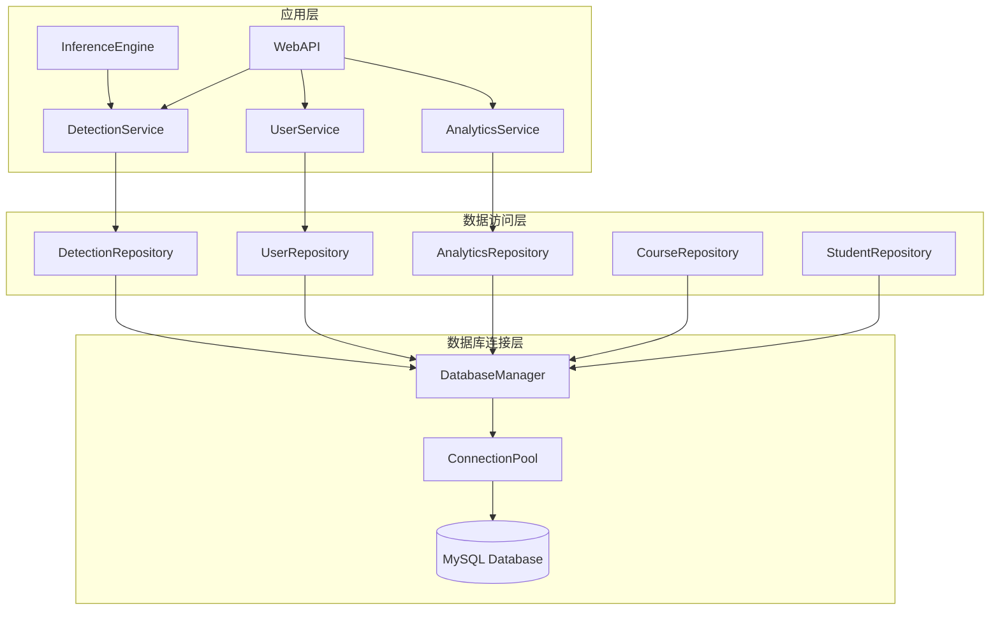
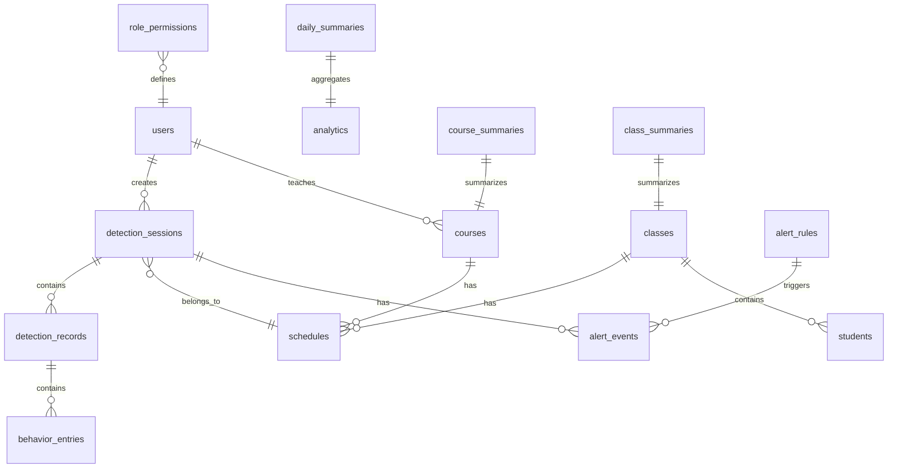

# Design Document

## Overview

本设计文档描述课堂行为检测系统的数据库模块架构，使用MySQL作为持久化存储，支持检测数据存储、用户管理、课堂信息管理和全景分析功能。系统采用分层架构，包含数据库连接层、数据访问层和业务逻辑层。

## Architecture



### 系统架构说明

1. **数据库连接层**: 管理MySQL连接池，提供统一的数据库访问接口
2. **数据访问层**: 各Repository类封装具体的CRUD操作
3. **应用层**: Service类提供业务逻辑，供推理引擎和Web API调用

## Components and Interfaces

### 1. 数据库配置 (DatabaseConfig)

```python
from dataclasses import dataclass

@dataclass
class DatabaseConfig:
    """数据库配置"""
    host: str = "localhost"
    port: int = 3306
    user: str = "root"
    password: str = "123456"
    database: str = "classroom_behavior_db"
    pool_size: int = 5
    pool_recycle: int = 3600
    charset: str = "utf8mb4"
```

### 2. 数据库管理器 (DatabaseManager)

```python
class DatabaseManager:
    """数据库连接管理器"""
    
    def __init__(self, config: DatabaseConfig)
    
    def get_connection(self) -> Connection
        """从连接池获取连接"""
    
    def release_connection(self, conn: Connection) -> None
        """释放连接回连接池"""
    
    def execute(self, sql: str, params: tuple = None) -> int
        """执行SQL语句，返回影响行数"""
    
    def query(self, sql: str, params: tuple = None) -> list[dict]
        """执行查询，返回结果列表"""
    
    def execute_many(self, sql: str, params_list: list[tuple]) -> int
        """批量执行SQL语句"""
    
    def transaction(self) -> ContextManager
        """事务上下文管理器"""
    
    def init_database(self) -> None
        """初始化数据库和表结构"""
    
    def close(self) -> None
        """关闭所有连接"""
```

### 3. 检测数据仓库 (DetectionRepository)

```python
class DetectionRepository:
    """检测数据访问层"""
    
    def __init__(self, db: DatabaseManager)
    
    # Session操作
    def create_session(self, source_type: str, source_path: str, 
                       user_id: int = None, schedule_id: int = None) -> int
    def update_session(self, session_id: int, end_time: datetime, 
                       total_frames: int) -> None
    def get_session(self, session_id: int) -> dict
    def list_sessions(self, start_date: date = None, end_date: date = None,
                      user_id: int = None, limit: int = 100, offset: int = 0) -> list[dict]
    def delete_session(self, session_id: int) -> None
    
    # Record操作
    def create_record(self, session_id: int, frame_id: int, timestamp: float,
                      alert_triggered: bool, detection_count: int) -> int
    def create_records_batch(self, records: list[dict]) -> int
    def get_records_by_session(self, session_id: int, 
                               limit: int = 1000, offset: int = 0) -> list[dict]
    
    # Entry操作
    def create_entry(self, record_id: int, bbox: tuple, class_id: int,
                     class_name: str, confidence: float, behavior_type: str,
                     alert_level: int) -> int
    def create_entries_batch(self, entries: list[dict]) -> int
    def get_entries_by_record(self, record_id: int) -> list[dict]
    def get_entries_by_behavior(self, session_id: int, 
                                behavior_type: str = None,
                                alert_level: int = None) -> list[dict]
```

### 4. 用户仓库 (UserRepository)

```python
class UserRepository:
    """用户数据访问层"""
    
    def __init__(self, db: DatabaseManager)
    
    def create_user(self, username: str, password: str, email: str,
                    role: str = 'viewer') -> int
    def get_user(self, user_id: int) -> dict
    def get_user_by_username(self, username: str) -> dict
    def update_user(self, user_id: int, **kwargs) -> None
    def delete_user(self, user_id: int) -> None
    def list_users(self, role: str = None) -> list[dict]
    def update_last_login(self, user_id: int) -> None
    def verify_password(self, username: str, password: str) -> dict
    
    # 权限操作
    def get_permissions(self, role: str) -> list[str]
    def set_permission(self, role: str, permission: str, is_allowed: bool) -> None
    def has_permission(self, user_id: int, permission: str) -> bool
```

### 5. 课程仓库 (CourseRepository)

```python
class CourseRepository:
    """课程数据访问层"""
    
    def __init__(self, db: DatabaseManager)
    
    # 课程操作
    def create_course(self, course_name: str, course_code: str,
                      teacher_id: int, semester: str, description: str = None) -> int
    def get_course(self, course_id: int) -> dict
    def list_courses(self, teacher_id: int = None, semester: str = None) -> list[dict]
    def update_course(self, course_id: int, **kwargs) -> None
    def delete_course(self, course_id: int) -> None
    
    # 班级操作
    def create_class(self, class_name: str, grade: str, 
                     department: str, student_count: int = 0) -> int
    def get_class(self, class_id: int) -> dict
    def list_classes(self, department: str = None) -> list[dict]
    
    # 课堂安排操作
    def create_schedule(self, course_id: int, class_id: int, classroom: str,
                        weekday: int, start_time: time, end_time: time) -> int
    def get_schedule(self, schedule_id: int) -> dict
    def list_schedules(self, course_id: int = None, class_id: int = None) -> list[dict]
```

### 6. 学生仓库 (StudentRepository)

```python
class StudentRepository:
    """学生数据访问层"""
    
    def __init__(self, db: DatabaseManager)
    
    def create_student(self, student_number: str, name: str, class_id: int,
                       gender: str = None, enrollment_year: int = None) -> int
    def get_student(self, student_id: int) -> dict
    def get_student_by_number(self, student_number: str) -> dict
    def list_students(self, class_id: int = None) -> list[dict]
    def update_student(self, student_id: int, **kwargs) -> None
    def delete_student(self, student_id: int) -> None
    def import_students_batch(self, students: list[dict]) -> int
```

### 7. 分析仓库 (AnalyticsRepository)

```python
class AnalyticsRepository:
    """分析数据访问层"""
    
    def __init__(self, db: DatabaseManager)
    
    # 统计查询
    def get_session_statistics(self, session_id: int) -> dict
    def get_behavior_distribution(self, start_date: date, end_date: date) -> dict
    def get_alert_distribution(self, start_date: date, end_date: date) -> dict
    def get_top_warning_behaviors(self, start_date: date, end_date: date, 
                                   limit: int = 5) -> list[dict]
    
    # 汇总数据
    def save_daily_summary(self, date: date, summary: dict) -> None
    def get_daily_summary(self, date: date) -> dict
    def get_daily_summaries(self, start_date: date, end_date: date) -> list[dict]
    
    def save_course_summary(self, course_id: int, period: str, summary: dict) -> None
    def get_course_summary(self, course_id: int, period: str) -> dict
    
    def save_class_summary(self, class_id: int, period: str, summary: dict) -> None
    def get_class_summary(self, class_id: int, period: str) -> dict
    
    # 注意力指数
    def calculate_attention_rate(self, session_id: int) -> float
    def get_attention_trend(self, course_id: int = None, class_id: int = None,
                            start_date: date = None, end_date: date = None) -> list[dict]
    
    # 预警规则
    def create_alert_rule(self, rule_name: str, behavior_type: str,
                          threshold_count: int, time_window: int,
                          alert_level: int) -> int
    def get_alert_rules(self, is_active: bool = True) -> list[dict]
    def update_alert_rule(self, rule_id: int, **kwargs) -> None
    
    # 预警事件
    def create_alert_event(self, rule_id: int, session_id: int,
                           behavior_count: int) -> int
    def get_alert_events(self, session_id: int = None, 
                         start_date: date = None, end_date: date = None) -> list[dict]
    def resolve_alert_event(self, event_id: int) -> None
```

## Data Models

### 数据库ER图



### 表结构定义

```sql
-- 用户表
CREATE TABLE users (
    user_id INT PRIMARY KEY AUTO_INCREMENT,
    username VARCHAR(50) UNIQUE NOT NULL,
    password_hash VARCHAR(255) NOT NULL,
    email VARCHAR(100),
    role ENUM('admin', 'teacher', 'student', 'viewer') DEFAULT 'viewer',
    created_at TIMESTAMP DEFAULT CURRENT_TIMESTAMP,
    last_login TIMESTAMP NULL,
    is_active BOOLEAN DEFAULT TRUE,
    INDEX idx_role (role),
    INDEX idx_username (username)
);

-- 角色权限表
CREATE TABLE role_permissions (
    id INT PRIMARY KEY AUTO_INCREMENT,
    role ENUM('admin', 'teacher', 'student', 'viewer') NOT NULL,
    permission_name VARCHAR(50) NOT NULL,
    is_allowed BOOLEAN DEFAULT TRUE,
    UNIQUE KEY uk_role_permission (role, permission_name)
);

-- 班级表
CREATE TABLE classes (
    class_id INT PRIMARY KEY AUTO_INCREMENT,
    class_name VARCHAR(100) NOT NULL,
    grade VARCHAR(20),
    department VARCHAR(100),
    student_count INT DEFAULT 0,
    created_at TIMESTAMP DEFAULT CURRENT_TIMESTAMP,
    INDEX idx_department (department)
);

-- 学生表
CREATE TABLE students (
    student_id INT PRIMARY KEY AUTO_INCREMENT,
    student_number VARCHAR(50) UNIQUE NOT NULL,
    name VARCHAR(100) NOT NULL,
    class_id INT,
    gender ENUM('male', 'female', 'other'),
    enrollment_year INT,
    created_at TIMESTAMP DEFAULT CURRENT_TIMESTAMP,
    FOREIGN KEY (class_id) REFERENCES classes(class_id) ON DELETE SET NULL,
    INDEX idx_class (class_id),
    INDEX idx_student_number (student_number)
);

-- 课程表
CREATE TABLE courses (
    course_id INT PRIMARY KEY AUTO_INCREMENT,
    course_name VARCHAR(200) NOT NULL,
    course_code VARCHAR(50),
    teacher_id INT,
    semester VARCHAR(20),
    description TEXT,
    created_at TIMESTAMP DEFAULT CURRENT_TIMESTAMP,
    FOREIGN KEY (teacher_id) REFERENCES users(user_id) ON DELETE SET NULL,
    INDEX idx_teacher (teacher_id),
    INDEX idx_semester (semester)
);

-- 课堂安排表
CREATE TABLE schedules (
    schedule_id INT PRIMARY KEY AUTO_INCREMENT,
    course_id INT NOT NULL,
    class_id INT NOT NULL,
    classroom VARCHAR(100),
    weekday TINYINT CHECK (weekday BETWEEN 1 AND 7),
    start_time TIME,
    end_time TIME,
    FOREIGN KEY (course_id) REFERENCES courses(course_id) ON DELETE CASCADE,
    FOREIGN KEY (class_id) REFERENCES classes(class_id) ON DELETE CASCADE,
    INDEX idx_course (course_id),
    INDEX idx_class (class_id)
);

-- 检测会话表
CREATE TABLE detection_sessions (
    session_id INT PRIMARY KEY AUTO_INCREMENT,
    user_id INT,
    schedule_id INT,
    source_type ENUM('image', 'video', 'stream') NOT NULL,
    source_path VARCHAR(500),
    start_time TIMESTAMP DEFAULT CURRENT_TIMESTAMP,
    end_time TIMESTAMP NULL,
    total_frames INT DEFAULT 0,
    status ENUM('running', 'completed', 'failed') DEFAULT 'running',
    FOREIGN KEY (user_id) REFERENCES users(user_id) ON DELETE SET NULL,
    FOREIGN KEY (schedule_id) REFERENCES schedules(schedule_id) ON DELETE SET NULL,
    INDEX idx_user (user_id),
    INDEX idx_schedule (schedule_id),
    INDEX idx_start_time (start_time)
);

-- 检测记录表
CREATE TABLE detection_records (
    record_id INT PRIMARY KEY AUTO_INCREMENT,
    session_id INT NOT NULL,
    frame_id INT NOT NULL,
    timestamp DOUBLE NOT NULL,
    alert_triggered BOOLEAN DEFAULT FALSE,
    detection_count INT DEFAULT 0,
    FOREIGN KEY (session_id) REFERENCES detection_sessions(session_id) ON DELETE CASCADE,
    INDEX idx_session (session_id),
    INDEX idx_frame (session_id, frame_id)
);

-- 行为条目表
CREATE TABLE behavior_entries (
    entry_id INT PRIMARY KEY AUTO_INCREMENT,
    record_id INT NOT NULL,
    bbox_x1 FLOAT NOT NULL,
    bbox_y1 FLOAT NOT NULL,
    bbox_x2 FLOAT NOT NULL,
    bbox_y2 FLOAT NOT NULL,
    class_id TINYINT NOT NULL,
    class_name VARCHAR(50) NOT NULL,
    confidence FLOAT NOT NULL,
    behavior_type ENUM('normal', 'warning') NOT NULL,
    alert_level TINYINT DEFAULT 0,
    FOREIGN KEY (record_id) REFERENCES detection_records(record_id) ON DELETE CASCADE,
    INDEX idx_record (record_id),
    INDEX idx_behavior (behavior_type, alert_level),
    INDEX idx_class (class_id)
);

-- 预警规则表
CREATE TABLE alert_rules (
    rule_id INT PRIMARY KEY AUTO_INCREMENT,
    rule_name VARCHAR(100) NOT NULL,
    behavior_type VARCHAR(50),
    class_id TINYINT,
    threshold_count INT NOT NULL,
    time_window_seconds INT NOT NULL,
    alert_level TINYINT DEFAULT 1,
    is_active BOOLEAN DEFAULT TRUE,
    created_at TIMESTAMP DEFAULT CURRENT_TIMESTAMP,
    INDEX idx_active (is_active)
);

-- 预警事件表
CREATE TABLE alert_events (
    event_id INT PRIMARY KEY AUTO_INCREMENT,
    rule_id INT NOT NULL,
    session_id INT NOT NULL,
    triggered_at TIMESTAMP DEFAULT CURRENT_TIMESTAMP,
    behavior_count INT NOT NULL,
    is_resolved BOOLEAN DEFAULT FALSE,
    resolved_at TIMESTAMP NULL,
    FOREIGN KEY (rule_id) REFERENCES alert_rules(rule_id) ON DELETE CASCADE,
    FOREIGN KEY (session_id) REFERENCES detection_sessions(session_id) ON DELETE CASCADE,
    INDEX idx_session (session_id),
    INDEX idx_triggered (triggered_at)
);

-- 每日汇总表
CREATE TABLE daily_summaries (
    id INT PRIMARY KEY AUTO_INCREMENT,
    summary_date DATE UNIQUE NOT NULL,
    total_sessions INT DEFAULT 0,
    total_detections INT DEFAULT 0,
    behavior_distribution JSON,
    alert_distribution JSON,
    avg_attention_rate FLOAT,
    created_at TIMESTAMP DEFAULT CURRENT_TIMESTAMP,
    INDEX idx_date (summary_date)
);

-- 课程汇总表
CREATE TABLE course_summaries (
    id INT PRIMARY KEY AUTO_INCREMENT,
    course_id INT NOT NULL,
    period VARCHAR(20) NOT NULL,
    period_start DATE,
    period_end DATE,
    total_sessions INT DEFAULT 0,
    avg_attention_rate FLOAT,
    behavior_trends JSON,
    created_at TIMESTAMP DEFAULT CURRENT_TIMESTAMP,
    FOREIGN KEY (course_id) REFERENCES courses(course_id) ON DELETE CASCADE,
    UNIQUE KEY uk_course_period (course_id, period, period_start),
    INDEX idx_course (course_id)
);

-- 班级汇总表
CREATE TABLE class_summaries (
    id INT PRIMARY KEY AUTO_INCREMENT,
    class_id INT NOT NULL,
    period VARCHAR(20) NOT NULL,
    period_start DATE,
    period_end DATE,
    total_sessions INT DEFAULT 0,
    avg_attention_rate FLOAT,
    top_warning_behaviors JSON,
    created_at TIMESTAMP DEFAULT CURRENT_TIMESTAMP,
    FOREIGN KEY (class_id) REFERENCES classes(class_id) ON DELETE CASCADE,
    UNIQUE KEY uk_class_period (class_id, period, period_start),
    INDEX idx_class (class_id)
);
```

### 默认权限配置

```sql
-- 初始化角色权限
INSERT INTO role_permissions (role, permission_name, is_allowed) VALUES
-- Admin权限
('admin', 'view_sessions', TRUE),
('admin', 'create_session', TRUE),
('admin', 'delete_session', TRUE),
('admin', 'view_statistics', TRUE),
('admin', 'manage_users', TRUE),
('admin', 'export_data', TRUE),
-- Teacher权限
('teacher', 'view_sessions', TRUE),
('teacher', 'create_session', TRUE),
('teacher', 'delete_session', FALSE),
('teacher', 'view_statistics', TRUE),
('teacher', 'manage_users', FALSE),
('teacher', 'export_data', TRUE),
-- Student权限
('student', 'view_sessions', TRUE),
('student', 'create_session', FALSE),
('student', 'delete_session', FALSE),
('student', 'view_statistics', TRUE),
('student', 'manage_users', FALSE),
('student', 'export_data', FALSE),
-- Viewer权限
('viewer', 'view_sessions', TRUE),
('viewer', 'create_session', FALSE),
('viewer', 'delete_session', FALSE),
('viewer', 'view_statistics', FALSE),
('viewer', 'manage_users', FALSE),
('viewer', 'export_data', FALSE);
```


## Correctness Properties

*A property is a characteristic or behavior that should hold true across all valid executions of a system-essentially, a formal statement about what the system should do. Properties serve as the bridge between human-readable specifications and machine-verifiable correctness guarantees.*

### Property 1: 数据CRUD往返一致性

*For any* valid Detection_Session, Detection_Record, or Behavior_Entry object, creating it in the database and then querying it by its ID SHALL return an equivalent object with all fields preserved.

**Validates: Requirements 2.1, 2.4, 3.1, 3.3, 4.1, 4.3**

### Property 2: 级联删除完整性

*For any* Detection_Session with associated Detection_Records and Behavior_Entries, deleting the session SHALL result in all associated records and entries being removed from the database, and subsequent queries for those records SHALL return empty results.

**Validates: Requirements 2.5**

### Property 3: 批量插入数据完整性

*For any* list of Detection_Records or Behavior_Entries, batch inserting them SHALL result in all items being stored, and the count of inserted items SHALL equal the length of the input list.

**Validates: Requirements 3.2, 4.2**

### Property 4: 时间范围查询正确性

*For any* time range [start_date, end_date] and any Detection_Session or Detection_Record created within that range, querying by that time range SHALL include that item in the results, and items created outside the range SHALL NOT be included.

**Validates: Requirements 2.3, 3.4**

### Property 5: 分页查询完整性

*For any* query with pagination parameters (limit, offset), the union of all paginated results SHALL equal the complete unpaginated result set, and each page SHALL contain at most 'limit' items.

**Validates: Requirements 3.5**

### Property 6: 用户密码加密存储

*For any* user created with a plaintext password, the stored password_hash SHALL NOT equal the plaintext password, and verifying the correct password SHALL return true while verifying an incorrect password SHALL return false.

**Validates: Requirements 6.3**

### Property 7: 用户角色权限一致性

*For any* user with a specific role, the permissions returned by get_permissions(role) SHALL match the configured permissions in role_permissions table, and has_permission() SHALL correctly reflect those permissions.

**Validates: Requirements 7.1, 7.2, 7.3, 7.4, 7.5, 7.6**

### Property 8: 统计聚合正确性

*For any* session with known behavior entries, the behavior distribution statistics SHALL correctly count each behavior type, and the sum of all behavior counts SHALL equal the total number of entries.

**Validates: Requirements 5.1, 5.2**

### Property 9: 事务原子性

*For any* batch operation within a transaction, if any individual operation fails, ALL operations in that transaction SHALL be rolled back, and the database state SHALL remain unchanged from before the transaction started.

**Validates: Requirements 12.1, 12.2**

### Property 10: SQL注入防护

*For any* input string containing SQL injection patterns (e.g., "'; DROP TABLE users; --"), the database operation SHALL either sanitize the input or use parameterized queries, and the malicious SQL SHALL NOT be executed.

**Validates: Requirements 12.3**

### Property 11: 外键引用完整性

*For any* foreign key relationship (e.g., Detection_Record.session_id → Detection_Session.session_id), inserting a record with a non-existent foreign key SHALL fail, and the database SHALL maintain referential integrity.

**Validates: Requirements 12.6**

### Property 12: 注意力指数计算正确性

*For any* session with behavior entries, the attention rate SHALL equal (normal_behavior_count / total_behavior_count), and the value SHALL be in range [0.0, 1.0].

**Validates: Requirements 10.4**

## Error Handling

### 数据库连接错误

| 错误类型 | 处理策略 | 日志级别 |
|---------|---------|---------|
| 连接超时 | 重试3次，间隔递增 | WARNING |
| 认证失败 | 抛出异常，提示检查凭据 | ERROR |
| 数据库不存在 | 自动创建数据库 | INFO |
| 连接池耗尽 | 等待可用连接，超时抛出异常 | WARNING |

### 数据操作错误

| 错误类型 | 处理策略 | 日志级别 |
|---------|---------|---------|
| 主键冲突 | 根据配置更新或忽略 | WARNING |
| 外键约束违反 | 抛出异常，提示关联数据 | ERROR |
| 数据类型错误 | 抛出异常，提示正确格式 | ERROR |
| 事务死锁 | 自动重试，最多3次 | WARNING |

### 查询错误

| 错误类型 | 处理策略 | 日志级别 |
|---------|---------|---------|
| 查询超时 | 返回部分结果或空结果 | WARNING |
| 结果集过大 | 强制分页，返回警告 | WARNING |
| 无效参数 | 抛出参数验证异常 | ERROR |

## Testing Strategy

### 单元测试

使用pytest框架进行单元测试，覆盖以下模块：

1. **DatabaseManager测试**
   - 测试连接池创建和管理
   - 测试事务提交和回滚
   - 测试SQL执行和查询

2. **Repository测试**
   - 测试各Repository的CRUD操作
   - 测试查询过滤和分页
   - 测试批量操作

3. **用户认证测试**
   - 测试密码加密和验证
   - 测试权限检查

### 属性测试

使用hypothesis库进行属性测试，每个属性测试运行至少100次迭代：

1. **Property 1**: 生成随机检测数据，验证CRUD往返一致性
2. **Property 2**: 生成随机会话和关联数据，验证级联删除
3. **Property 3**: 生成随机批量数据，验证批量插入完整性
4. **Property 4**: 生成随机时间范围和数据，验证时间查询
5. **Property 5**: 生成随机分页参数，验证分页完整性
6. **Property 6**: 生成随机密码，验证加密存储
7. **Property 7**: 生成随机角色和权限，验证权限一致性
8. **Property 8**: 生成随机行为数据，验证统计正确性
9. **Property 9**: 生成随机批量操作，验证事务原子性
10. **Property 10**: 生成SQL注入字符串，验证防护
11. **Property 11**: 生成无效外键，验证引用完整性
12. **Property 12**: 生成随机行为分布，验证注意力指数

### 集成测试

1. **端到端数据流测试**: 从检测结果到数据库存储的完整流程
2. **并发访问测试**: 多线程同时读写数据库
3. **性能测试**: 大批量数据插入和查询性能

### 测试配置

```python
# pytest.ini
[pytest]
testpaths = tests
python_files = test_*.py
python_functions = test_*
addopts = -v --tb=short

# 测试数据库配置
TEST_DB_CONFIG = {
    "host": "localhost",
    "port": 3306,
    "user": "root",
    "password": "123456",
    "database": "classroom_behavior_test_db"
}
```
