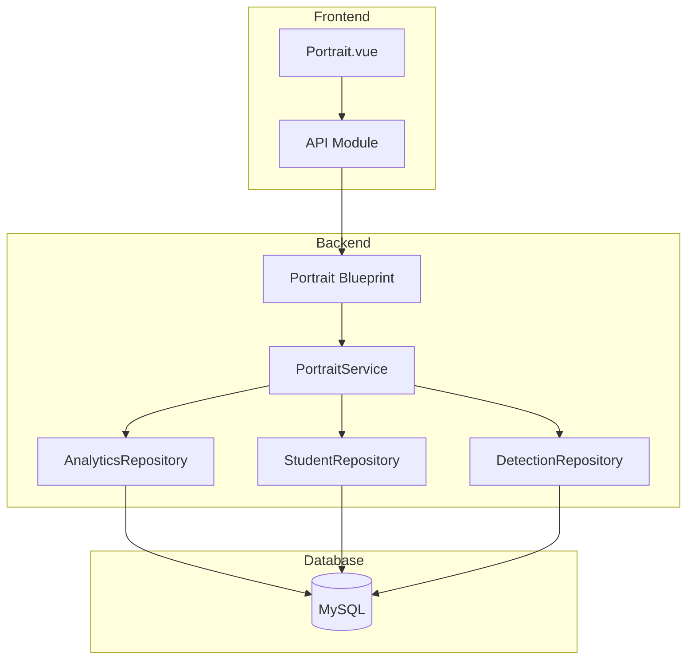

# Design Document: Student Portrait (学业全景画像)

## Overview

本设计文档描述了学业全景画像系统的架构和实现细节。该系统提供班级整体画像和学生个人画像功能，包括行为分布分析、注意力趋势、预警行为排名和个性化改进建议。

## Architecture

系统采用前后端分离架构：



## Components and Interfaces

### 1. PortraitService (画像服务)

```python
class PortraitService:
    """画像服务，负责生成和管理画像数据"""
    
    def __init__(self, db: DatabaseManager):
        """初始化服务"""
        pass
    
    def get_class_overview(
        self,
        class_id: int = None,
        start_date: date = None,
        end_date: date = None
    ) -> ClassOverview:
        """获取班级概览数据"""
        pass
    
    def get_behavior_distribution(
        self,
        class_id: int = None,
        start_date: date = None,
        end_date: date = None
    ) -> BehaviorDistribution:
        """获取行为分布统计"""
        pass
    
    def get_attention_trend(
        self,
        class_id: int = None,
        student_id: int = None,
        days: int = 7
    ) -> List[AttentionPoint]:
        """获取注意力趋势数据"""
        pass
    
    def get_warning_ranking(
        self,
        class_id: int = None,
        start_date: date = None,
        end_date: date = None,
        limit: int = 5
    ) -> List[WarningRank]:
        """获取预警行为排名"""
        pass
    
    def get_student_portrait(
        self,
        student_id: int,
        start_date: date = None,
        end_date: date = None
    ) -> StudentPortrait:
        """获取学生个人画像"""
        pass
    
    def get_improvement_suggestions(
        self,
        student_id: int
    ) -> List[Suggestion]:
        """获取学生改进建议"""
        pass
    
    def export_portrait_data(
        self,
        class_id: int = None,
        start_date: date = None,
        end_date: date = None
    ) -> Dict:
        """导出画像数据"""
        pass
```

### 2. Portrait API Blueprint

```python
# backend/api/PortraitController.py

@portrait_bp.route('/overview', methods=['GET'])
def get_overview():
    """获取班级概览"""
    pass

@portrait_bp.route('/behavior-distribution', methods=['GET'])
def get_behavior_distribution():
    """获取行为分布"""
    pass

@portrait_bp.route('/attention-trend', methods=['GET'])
def get_attention_trend():
    """获取注意力趋势"""
    pass

@portrait_bp.route('/warning-ranking', methods=['GET'])
def get_warning_ranking():
    """获取预警排名"""
    pass

@portrait_bp.route('/student/<int:student_id>', methods=['GET'])
def get_student_portrait(student_id):
    """获取学生个人画像"""
    pass

@portrait_bp.route('/student/<int:student_id>/suggestions', methods=['GET'])
def get_student_suggestions(student_id):
    """获取学生改进建议"""
    pass

@portrait_bp.route('/export', methods=['GET'])
def export_data():
    """导出画像数据"""
    pass
```

## Data Models

```python
from dataclasses import dataclass
from typing import List, Dict, Optional
from datetime import date, datetime

@dataclass
class ClassOverview:
    """班级概览数据"""
    total_sessions: int
    total_students: int
    total_detections: int
    avg_attention_rate: float
    behavior_distribution: Dict[str, int]
    recent_trend: List['AttentionPoint']
    warning_count: int
    
@dataclass
class BehaviorDistribution:
    """行为分布数据"""
    normal_behaviors: Dict[str, int]  # handrise, read, write
    warning_behaviors: Dict[str, int]  # sleep, stand, using_electronic_devices, talk
    total_count: int
    normal_rate: float
    warning_rate: float

@dataclass
class AttentionPoint:
    """注意力数据点"""
    date: date
    attention_rate: float
    session_count: int
    normal_count: int
    warning_count: int

@dataclass
class WarningRank:
    """预警行为排名项"""
    behavior_name: str
    behavior_name_cn: str
    count: int
    percentage: float
    alert_level: int

@dataclass
class StudentPortrait:
    """学生个人画像"""
    student_id: int
    student_name: str
    attention_rate: float
    class_avg_attention_rate: float
    behavior_distribution: Dict[str, int]
    attention_trend: List[AttentionPoint]
    improvement_areas: List[str]
    peer_comparison: 'PeerComparison'

@dataclass
class PeerComparison:
    """同伴对比数据（匿名）"""
    student_rank: int  # 学生在班级中的排名
    total_students: int
    percentile: float  # 百分位
    above_average: bool

@dataclass
class Suggestion:
    """改进建议"""
    behavior_type: str
    behavior_name_cn: str
    frequency: int
    suggestion_text: str
    priority: int  # 1=高, 2=中, 3=低
```

## Correctness Properties

*A property is a characteristic or behavior that should hold true across all valid executions of a system-essentially, a formal statement about what the system should do. Properties serve as the bridge between human-readable specifications and machine-verifiable correctness guarantees.*

### Property 1: Overview Data Completeness

*For any* class overview request, the response should contain total_sessions, total_students, avg_attention_rate, and behavior_distribution with all 7 behavior types.

**Validates: Requirements 1.2, 1.3, 1.4**

### Property 2: Behavior Distribution Completeness

*For any* behavior distribution request, the response should contain counts for all 7 behavior types, categorized into normal (3 types) and warning (4 types) behaviors.

**Validates: Requirements 2.1, 2.2**

### Property 3: Date Range Filtering

*For any* request with a date range, all returned data points should fall within the specified start_date and end_date (inclusive).

**Validates: Requirements 2.4**

### Property 4: Attention Rate Calculation

*For any* attention rate calculation, the result should equal normal_behaviors / total_behaviors, and should be between 0.0 and 1.0.

**Validates: Requirements 3.2**

### Property 5: Attention Trend Data Points

*For any* attention trend request, each data point should contain a date, attention_rate, and the rate should be calculated correctly for that date.

**Validates: Requirements 3.1, 3.5**

### Property 6: Warning Ranking Order

*For any* warning ranking request, the results should be sorted by count in descending order, and limited to the specified number (default 5).

**Validates: Requirements 4.1, 4.2**

### Property 7: Student Portrait Completeness

*For any* student portrait request, the response should contain the student's attention_rate, class_avg_attention_rate, behavior_distribution, attention_trend, and peer_comparison.

**Validates: Requirements 7.2, 7.3, 7.4, 7.5, 7.6**

### Property 8: Suggestion Generation

*For any* student with warning behaviors, the improvement suggestions should be generated based on their most frequent warning behaviors, with appropriate suggestion text for each behavior type.

**Validates: Requirements 8.1, 8.2, 8.3, 8.4**

### Property 9: Export Data Completeness

*For any* export request, the JSON output should contain metadata, behavior_distribution, attention_trend, and warning_ranking sections.

**Validates: Requirements 6.1, 6.2, 6.3**

### Property 10: Access Control

*For any* student portrait request, a student should only be able to access their own data, not other students' data.

**Validates: Requirements 9.9**

## Error Handling

| Error Scenario | Handling Strategy |
|----------------|-------------------|
| No data for date range | Return empty arrays with zero counts |
| Student not found | Return 404 with descriptive message |
| Unauthorized access | Return 401 for unauthenticated, 403 for forbidden |
| Database connection error | Return 500 with generic error message |
| Invalid date format | Return 400 with validation error |

## Testing Strategy

### Unit Tests

1. **PortraitService Tests**
   - 测试注意力指数计算
   - 测试行为分布统计
   - 测试日期范围过滤
   - 测试建议生成逻辑

2. **API Tests**
   - 测试各端点响应格式
   - 测试权限控制
   - 测试参数验证

### Property-Based Tests

使用 Hypothesis 库进行属性测试：

1. **Property 4: Attention Rate Calculation** - 验证计算公式正确性
2. **Property 6: Warning Ranking Order** - 验证排序正确性
3. **Property 3: Date Range Filtering** - 验证日期过滤正确性

## File Structure

```
backend/
├── api/
│   └── portrait.py          # API Blueprint
└── services/
    └── portrait_service.py   # 画像服务

frontend/
└── src/
    ├── api/
    │   └── index.js          # 添加 portrait API
    └── views/
        └── Portrait.vue      # 画像页面组件
```

## API Response Examples

### GET /api/portrait/overview

```json
{
  "success": true,
  "data": {
    "total_sessions": 150,
    "total_students": 45,
    "total_detections": 12500,
    "avg_attention_rate": 0.72,
    "behavior_distribution": {
      "handrise": 1200,
      "read": 4500,
      "write": 3200,
      "sleep": 450,
      "stand": 320,
      "using_electronic_devices": 280,
      "talk": 550
    },
    "warning_count": 1600,
    "recent_trend": [
      {"date": "2026-01-01", "attention_rate": 0.75},
      {"date": "2026-01-02", "attention_rate": 0.68}
    ]
  }
}
```

### GET /api/portrait/student/{student_id}

```json
{
  "success": true,
  "data": {
    "student_id": 123,
    "student_name": "张三",
    "attention_rate": 0.78,
    "class_avg_attention_rate": 0.72,
    "behavior_distribution": {
      "handrise": 45,
      "read": 120,
      "write": 85,
      "sleep": 8,
      "stand": 5,
      "using_electronic_devices": 12,
      "talk": 15
    },
    "attention_trend": [...],
    "improvement_areas": ["使用电子设备", "交谈"],
    "peer_comparison": {
      "student_rank": 12,
      "total_students": 45,
      "percentile": 73.3,
      "above_average": true
    }
  }
}
```
