# 系统架构图 (Mermaid)

## 一、系统总体架构图

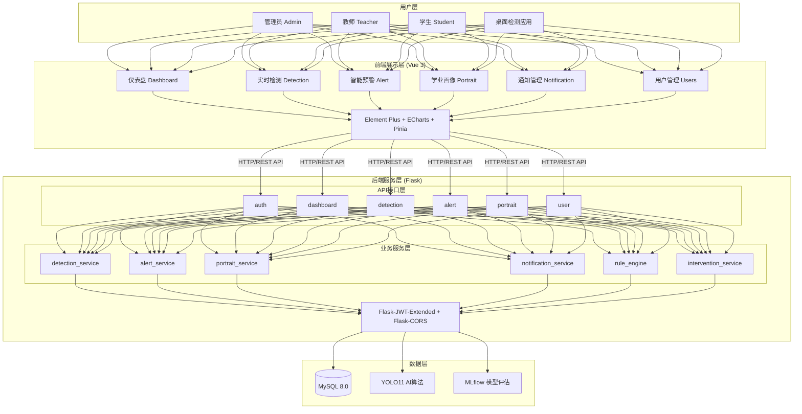
```mermaid
graph TB
    subgraph 用户层
        A1[管理员 Admin]
        A2[教师 Teacher]
        A3[学生 Student]
        A4[桌面检测应用]
    end

    subgraph 前端展示层["前端展示层 (Vue 3)"]
        B1[仪表盘 Dashboard]
        B2[实时检测 Detection]
        B3[智能预警 Alert]
        B4[学业画像 Portrait]
        B5[通知管理 Notification]
        B6[用户管理 Users]
        B7[Element Plus + ECharts + Pinia]
    end

    subgraph 后端服务层["后端服务层 (Flask)"]
        subgraph API接口层
            C1[auth]
            C2[dashboard]
            C3[detection]
            C4[alert]
            C5[portrait]
            C6[user]
        end
        subgraph 业务服务层
            D1[detection_service]
            D2[alert_service]
            D3[portrait_service]
            D4[notification_service]
            D5[rule_engine]
            D6[intervention_service]
        end
        E1[Flask-JWT-Extended + Flask-CORS]
    end

    subgraph 数据层
        F1[(MySQL 8.0)]
        F2[YOLO11 AI算法]
        F3[MLflow 模型评估]
    end

    A1 & A2 & A3 & A4 --> B1 & B2 & B3 & B4 & B5 & B6
    B1 & B2 & B3 & B4 & B5 & B6 --> B7
    B7 -->|HTTP/REST API| C1 & C2 & C3 & C4 & C5 & C6
    C1 & C2 & C3 & C4 & C5 & C6 --> D1 & D2 & D3 & D4 & D5 & D6
    D1 & D2 & D3 & D4 & D5 & D6 --> E1
    E1 --> F1 & F2 & F3
```

## 二、技术架构图

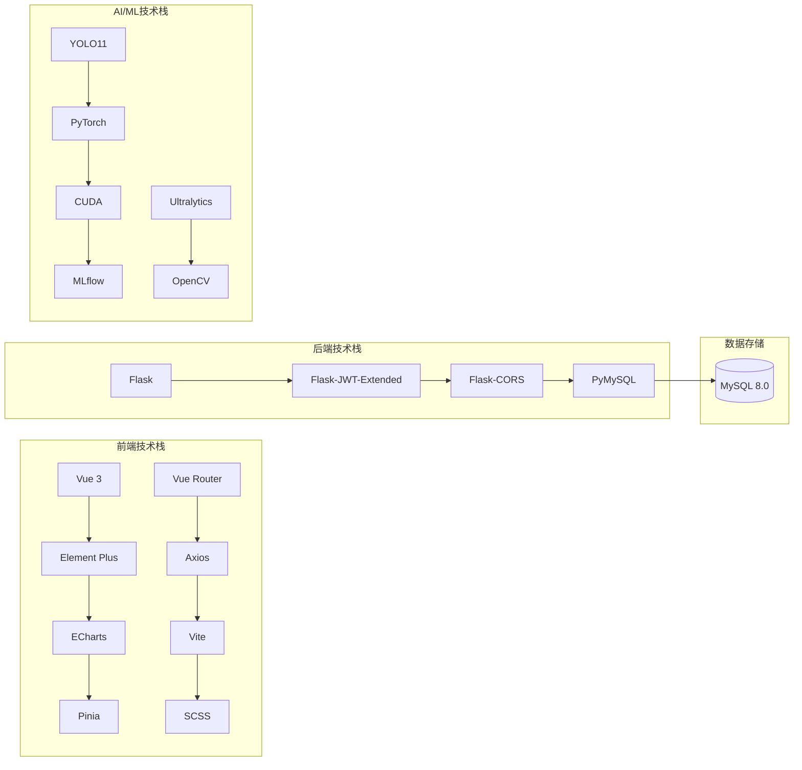
```mermaid
graph LR
    subgraph 前端技术栈
        FE1[Vue 3]
        FE2[Element Plus]
        FE3[ECharts]
        FE4[Pinia]
        FE5[Vue Router]
        FE6[Axios]
        FE7[Vite]
        FE8[SCSS]
    end

    subgraph 后端技术栈
        BE1[Flask]
        BE2[Flask-JWT-Extended]
        BE3[Flask-CORS]
        BE4[PyMySQL]
    end

    subgraph AI/ML技术栈
        AI1[YOLO11]
        AI2[PyTorch]
        AI3[CUDA]
        AI4[MLflow]
        AI5[Ultralytics]
        AI6[OpenCV]
    end

    subgraph 数据存储
        DB1[(MySQL 8.0)]
    end

    FE1 --> FE2 --> FE3 --> FE4
    FE5 --> FE6 --> FE7 --> FE8
    BE1 --> BE2 --> BE3 --> BE4
    AI1 --> AI2 --> AI3 --> AI4
    AI5 --> AI6
    BE4 --> DB1
```

## 三、功能模块架构图

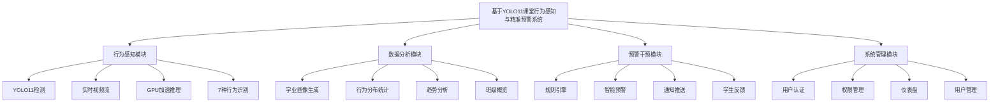
```mermaid
graph TB
    A[基于YOLO11课堂行为感知与精准预警系统]
    
    A --> B[行为感知模块]
    A --> C[数据分析模块]
    A --> D[预警干预模块]
    A --> E[系统管理模块]
    
    B --> B1[YOLO11检测]
    B --> B2[实时视频流]
    B --> B3[GPU加速推理]
    B --> B4[7种行为识别]
    
    C --> C1[学业画像生成]
    C --> C2[行为分布统计]
    C --> C3[趋势分析]
    C --> C4[班级概览]
    
    D --> D1[规则引擎]
    D --> D2[智能预警]
    D --> D3[通知推送]
    D --> D4[学生反馈]
    
    E --> E1[用户认证]
    E --> E2[权限管理]
    E --> E3[仪表盘]
    E --> E4[用户管理]
```

## 四、数据流架构图

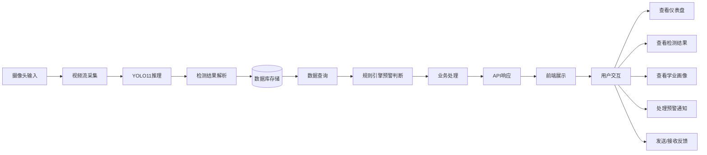
```mermaid
flowchart LR
    A[摄像头输入] --> B[视频流采集]
    B --> C[YOLO11推理]
    C --> D[检测结果解析]
    D --> E[(数据库存储)]
    
    E --> F[数据查询]
    F --> G[规则引擎预警判断]
    G --> H[业务处理]
    H --> I[API响应]
    I --> J[前端展示]
    
    J --> K[用户交互]
    K --> K1[查看仪表盘]
    K --> K2[查看检测结果]
    K --> K3[查看学业画像]
    K --> K4[处理预警通知]
    K --> K5[发送/接收反馈]
```

## 五、部署架构图

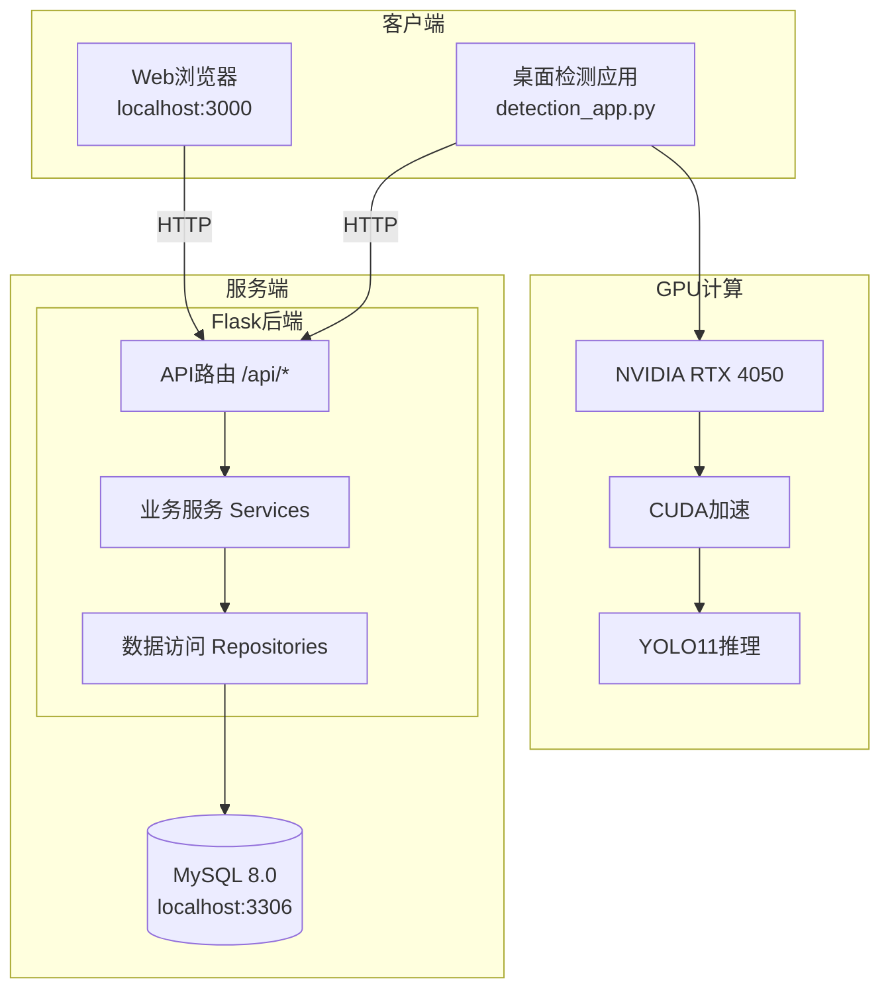
```mermaid
graph TB
    subgraph 客户端
        CL1[Web浏览器<br/>localhost:3000]
        CL2[桌面检测应用<br/>detection_app.py]
    end
    
    subgraph 服务端
        subgraph Flask后端
            SV1[API路由 /api/*]
            SV2[业务服务 Services]
            SV3[数据访问 Repositories]
        end
        SV4[(MySQL 8.0<br/>localhost:3306)]
    end
    
    subgraph GPU计算
        GPU1[NVIDIA RTX 4050]
        GPU2[CUDA加速]
        GPU3[YOLO11推理]
    end
    
    CL1 -->|HTTP| SV1
    CL2 -->|HTTP| SV1
    SV1 --> SV2 --> SV3 --> SV4
    CL2 --> GPU1 --> GPU2 --> GPU3
```

## 六、数据库ER图

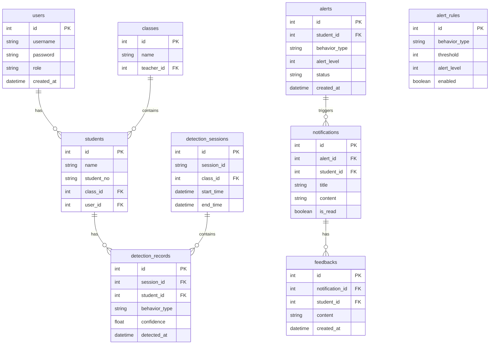
```mermaid
erDiagram
    users ||--o{ students : has
    users {
        int id PK
        string username
        string password
        string role
        datetime created_at
    }
    
    classes ||--o{ students : contains
    classes {
        int id PK
        string name
        int teacher_id FK
    }
    
    students ||--o{ detection_records : has
    students {
        int id PK
        string name
        string student_no
        int class_id FK
        int user_id FK
    }
    
    detection_sessions ||--o{ detection_records : contains
    detection_sessions {
        int id PK
        string session_id
        int class_id FK
        datetime start_time
        datetime end_time
    }
    
    detection_records {
        int id PK
        int session_id FK
        int student_id FK
        string behavior_type
        float confidence
        datetime detected_at
    }
    
    alerts ||--o{ notifications : triggers
    alerts {
        int id PK
        int student_id FK
        string behavior_type
        int alert_level
        string status
        datetime created_at
    }
    
    alert_rules {
        int id PK
        string behavior_type
        int threshold
        int alert_level
        boolean enabled
    }
    
    notifications ||--o{ feedbacks : has
    notifications {
        int id PK
        int alert_id FK
        int student_id FK
        string title
        string content
        boolean is_read
    }
    
    feedbacks {
        int id PK
        int notification_id FK
        int student_id FK
        string content
        datetime created_at
    }
```

## 七、角色权限架构图

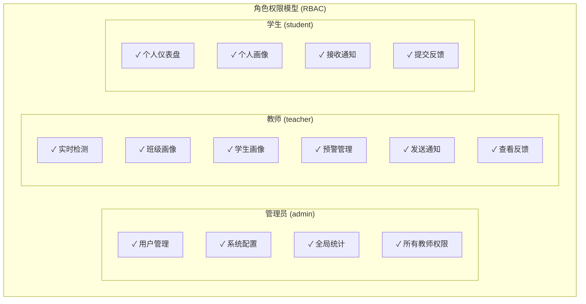
```mermaid
graph TB
    subgraph 角色权限模型["角色权限模型 (RBAC)"]
        subgraph 管理员["管理员 (admin)"]
            AD1[✓ 用户管理]
            AD2[✓ 系统配置]
            AD3[✓ 全局统计]
            AD4[✓ 所有教师权限]
        end
        
        subgraph 教师["教师 (teacher)"]
            TE1[✓ 实时检测]
            TE2[✓ 班级画像]
            TE3[✓ 学生画像]
            TE4[✓ 预警管理]
            TE5[✓ 发送通知]
            TE6[✓ 查看反馈]
        end
        
        subgraph 学生["学生 (student)"]
            ST1[✓ 个人仪表盘]
            ST2[✓ 个人画像]
            ST3[✓ 接收通知]
            ST4[✓ 提交反馈]
        end
    end
```

## 八、API接口架构图

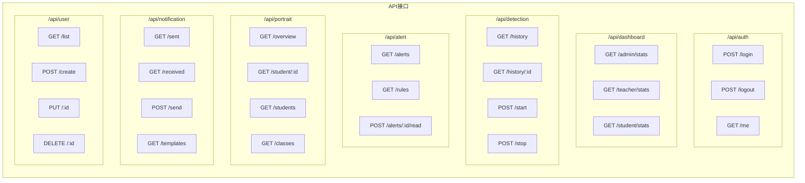
```mermaid
graph LR
    subgraph API接口
        subgraph 认证模块["/api/auth"]
            AUTH1[POST /login]
            AUTH2[POST /logout]
            AUTH3[GET /me]
        end
        
        subgraph 仪表盘模块["/api/dashboard"]
            DASH1[GET /admin/stats]
            DASH2[GET /teacher/stats]
            DASH3[GET /student/stats]
        end
        
        subgraph 检测模块["/api/detection"]
            DET1[GET /history]
            DET2[GET /history/:id]
            DET3[POST /start]
            DET4[POST /stop]
        end
        
        subgraph 预警模块["/api/alert"]
            ALT1[GET /alerts]
            ALT2[GET /rules]
            ALT3[POST /alerts/:id/read]
        end
        
        subgraph 画像模块["/api/portrait"]
            POR1[GET /overview]
            POR2[GET /student/:id]
            POR3[GET /students]
            POR4[GET /classes]
        end
        
        subgraph 通知模块["/api/notification"]
            NOT1[GET /sent]
            NOT2[GET /received]
            NOT3[POST /send]
            NOT4[GET /templates]
        end
        
        subgraph 用户模块["/api/user"]
            USR1[GET /list]
            USR2[POST /create]
            USR3[PUT /:id]
            USR4[DELETE /:id]
        end
    end
```

## 九、行为检测流程图

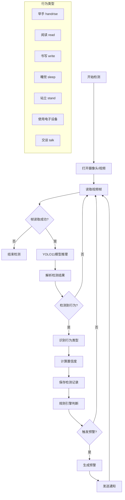
```mermaid
flowchart TD
    A[开始检测] --> B[打开摄像头/视频]
    B --> C[读取视频帧]
    C --> D{帧读取成功?}
    D -->|否| E[结束检测]
    D -->|是| F[YOLO11模型推理]
    F --> G[解析检测结果]
    G --> H{检测到行为?}
    H -->|否| C
    H -->|是| I[识别行为类型]
    I --> J[计算置信度]
    J --> K[保存检测记录]
    K --> L[规则引擎判断]
    L --> M{触发预警?}
    M -->|否| C
    M -->|是| N[生成预警]
    N --> O[发送通知]
    O --> C
    
    subgraph 行为类型
        BH1[举手 handrise]
        BH2[阅读 read]
        BH3[书写 write]
        BH4[睡觉 sleep]
        BH5[站立 stand]
        BH6[使用电子设备]
        BH7[交谈 talk]
    end
```

## 十、系统时序图

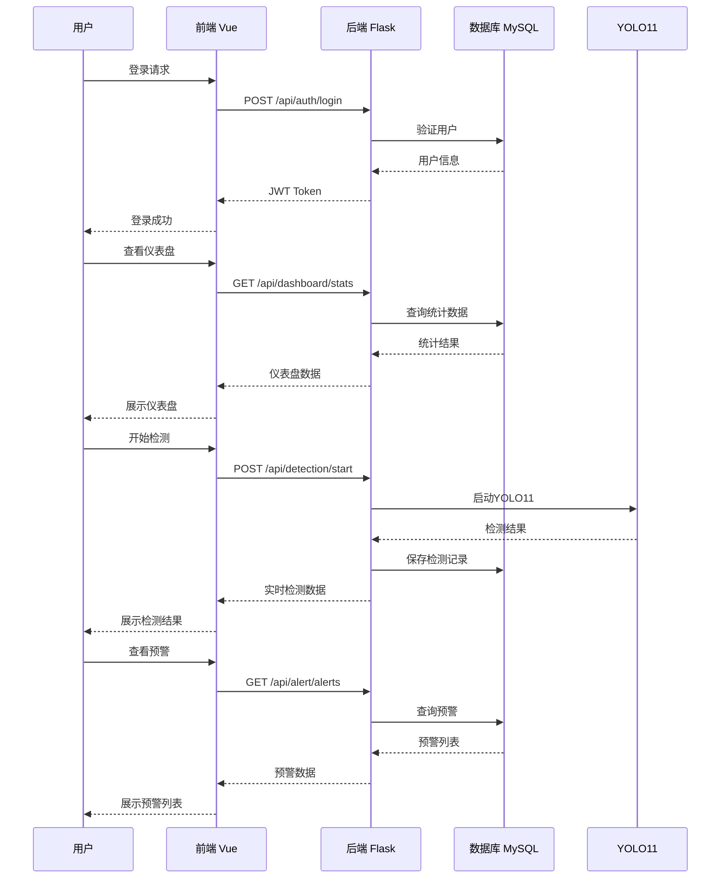
```mermaid
sequenceDiagram
    participant U as 用户
    participant F as 前端 Vue
    participant B as 后端 Flask
    participant D as 数据库 MySQL
    participant Y as YOLO11
    
    U->>F: 登录请求
    F->>B: POST /api/auth/login
    B->>D: 验证用户
    D-->>B: 用户信息
    B-->>F: JWT Token
    F-->>U: 登录成功
    
    U->>F: 查看仪表盘
    F->>B: GET /api/dashboard/stats
    B->>D: 查询统计数据
    D-->>B: 统计结果
    B-->>F: 仪表盘数据
    F-->>U: 展示仪表盘
    
    U->>F: 开始检测
    F->>B: POST /api/detection/start
    B->>Y: 启动YOLO11
    Y-->>B: 检测结果
    B->>D: 保存检测记录
    B-->>F: 实时检测数据
    F-->>U: 展示检测结果
    
    U->>F: 查看预警
    F->>B: GET /api/alert/alerts
    B->>D: 查询预警
    D-->>B: 预警列表
    B-->>F: 预警数据
    F-->>U: 展示预警列表
```

## 十一、目录结构图

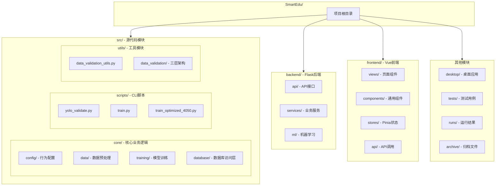
```mermaid
graph TB
    subgraph 项目根目录["SmartEdu/"]
        ROOT[项目根目录]
    end
    
    subgraph 源代码模块["src/ - 源代码模块"]
        subgraph 核心模块["core/ - 核心业务逻辑"]
            CORE1[config/ - 行为配置]
            CORE2[data/ - 数据预处理]
            CORE3[training/ - 模型训练]
            CORE4[database/ - 数据库访问层]
        end
        
        subgraph 脚本模块["scripts/ - CLI脚本"]
            SC1[yolo_validate.py]
            SC2[train.py]
            SC3[train_optimized_4050.py]
        end
        
        subgraph 工具模块["utils/ - 工具模块"]
            UT1[data_validation_utils.py]
            UT2[data_validation/ - 三层架构]
        end
    end
    
    subgraph 后端模块["backend/ - Flask后端"]
        BE1[api/ - API接口]
        BE2[services/ - 业务服务]
        BE3[ml/ - 机器学习]
    end
    
    subgraph 前端模块["frontend/ - Vue前端"]
        FE1[views/ - 页面组件]
        FE2[components/ - 通用组件]
        FE3[stores/ - Pinia状态]
        FE4[api/ - API调用]
    end
    
    subgraph 其他模块
        OT1[desktop/ - 桌面应用]
        OT2[tests/ - 测试用例]
        OT3[runs/ - 运行结果]
        OT4[archive/ - 归档文件]
    end
    
    ROOT --> 源代码模块
    ROOT --> 后端模块
    ROOT --> 前端模块
    ROOT --> 其他模块
```
