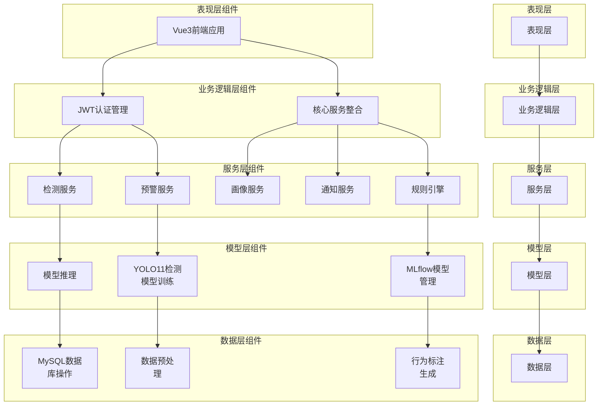
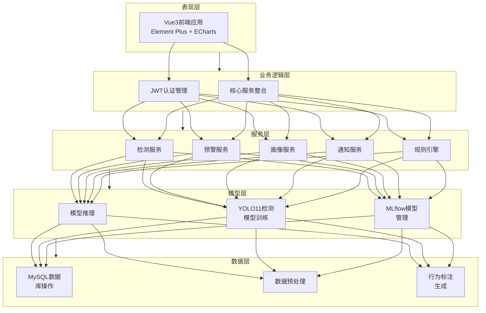
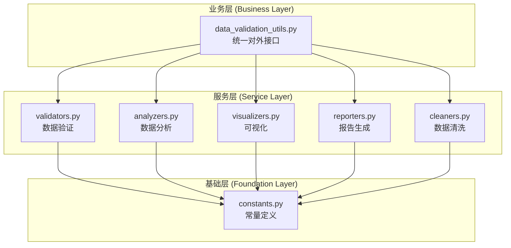

# 系统架构图（分层结构）

## 基于YOLO11课堂行为感知与精准预警系统架构图



---

## 简化版架构图



---

## 目录结构与分层对应

```
┌─────────────────────────────────────────────────────────────────────────────────┐
│                              分层架构与目录映射                                   │
└─────────────────────────────────────────────────────────────────────────────────┘

┌─────────────────┬───────────────────────────────────────────────────────────────┐
│     分层        │                        目录/文件                               │
├─────────────────┼───────────────────────────────────────────────────────────────┤
│   表现层        │  frontend/src/views/                                          │
│                 │  frontend/src/components/                                     │
│                 │  frontend/src/stores/                                         │
├─────────────────┼───────────────────────────────────────────────────────────────┤
│   业务逻辑层    │  backend/api/                                                 │
│                 │  backend/app.py                                               │
├─────────────────┼───────────────────────────────────────────────────────────────┤
│   服务层        │  backend/services/                                            │
│                 │    ├── detection_service.py                                   │
│                 │    ├── alert_service.py                                       │
│                 │    ├── portrait_service.py                                    │
│                 │    ├── notification_service.py                                │
│                 │    ├── rule_engine.py                                         │
│                 │    └── intervention_service.py                                │
├─────────────────┼───────────────────────────────────────────────────────────────┤
│   模型层        │  backend/ml/mlflow_tracker.py                                 │
│                 │  src/core/training/training_pipeline.py                       │
│                 │  src/scripts/train.py                                         │
│                 │  src/scripts/train_optimized_4050.py                          │
├─────────────────┼───────────────────────────────────────────────────────────────┤
│   数据层        │  src/core/database/                                           │
│                 │    ├── repositories/ (8个数据仓库)                            │
│                 │    ├── manager.py                                             │
│                 │    └── config.py                                              │
│                 │  src/core/data/                                               │
│                 │    ├── data_merger.py                                         │
│                 │    └── label_mapper.py                                        │
├─────────────────┼───────────────────────────────────────────────────────────────┤
│   工具层        │  src/utils/                                                   │
│                 │    ├── data_validation_utils.py (业务层)                      │
│                 │    └── data_validation/ (三层架构)                            │
│                 │        ├── constants.py                                       │
│                 │        ├── validators.py                                      │
│                 │        ├── analyzers.py                                       │
│                 │        ├── visualizers.py                                     │
│                 │        ├── reporters.py                                       │
│                 │        └── cleaners.py                                        │
└─────────────────┴───────────────────────────────────────────────────────────────┘
```

---

## 三层架构详解：src/utils/data_validation/



### 各模块职责

| 模块 | 职责 | 主要功能 |
|------|------|----------|
| constants.py | 常量定义 | 行为类别、颜色映射、阈值配置 |
| validators.py | 数据验证 | 标签格式验证、边界框验证 |
| analyzers.py | 数据分析 | 类别分布、数据集统计 |
| visualizers.py | 可视化 | 分布图、混淆矩阵、样本展示 |
| reporters.py | 报告生成 | HTML/Markdown报告 |
| cleaners.py | 数据清洗 | 异常数据修复、格式标准化 |
| data_validation_utils.py | 业务入口 | 统一调用接口 |

---

## src/ 目录结构

```
src/                            # 源代码模块
├── core/                       # 核心业务逻辑
│   ├── config/                 # 行为配置
│   │   └── behavior_config.py
│   ├── data/                   # 数据预处理
│   │   ├── data_merger.py
│   │   └── label_mapper.py
│   ├── training/               # 模型训练
│   │   └── training_pipeline.py
│   └── database/               # 数据库访问层
│       ├── config.py
│       ├── manager.py
│       ├── repositories/       # 数据仓库 (8个)
│       └── services/
├── scripts/                    # CLI脚本入口
│   ├── yolo_validate.py        # 模型验证
│   ├── train.py                # 模型训练
│   └── train_optimized_4050.py # RTX 4050优化训练
└── utils/                      # 工具模块
    ├── data_validation_utils.py  # 业务层服务
    └── data_validation/          # 三层架构
        ├── constants.py
        ├── validators.py
        ├── analyzers.py
        ├── visualizers.py
        ├── reporters.py
        └── cleaners.py
```
