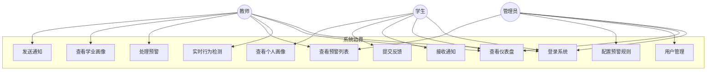
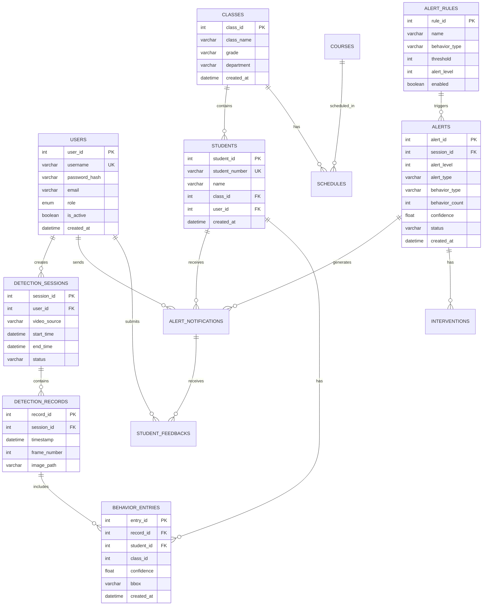

# 课堂行为智能检测与学业画像系统

## 一、项目概述

本系统是一个基于YOLO11深度学习的课堂行为智能检测与学业画像平台，能够实时识别学生的7种课堂行为（举手、阅读、书写、睡觉、站立、使用电子设备、交谈），并基于多维时空数据构建学生学业画像，实现精准预警。

### 核心功能

| 功能模块 | 描述 |
|---------|------|
| 实时行为检测 | YOLO11模型实时分析视频流，识别课堂行为 |
| 智能预警 | 基于规则引擎的多级预警机制（轻度/中度/严重） |
| 学业画像 | 多维度学生行为分析与可视化展示 |
| 预警通知 | 师生互动通知与反馈闭环管理 |
| 用户管理 | 管理员/教师/学生三角色权限控制 |
| 行为去重 | 基于IoU追踪的智能去重，避免重复记录 |

---

## 二、项目结构

### 整体架构

```
┌─────────────────────────────────────────────────────────────┐
│                    前端 (Vue 3 + Element Plus)               │
│   Dashboard │ Detection │ Alert │ Portrait │ Notification   │
└─────────────────────────────────────────────────────────────┘
                              │ HTTP/REST API
                              ▼
┌─────────────────────────────────────────────────────────────┐
│                    后端 (Flask + JWT)                        │
│  ┌─────────────────────────────────────────────────────┐   │
│  │ Controller层 - API路由 (auth/user/detection/alert)   │   │
│  ├─────────────────────────────────────────────────────┤   │
│  │ Service层 - 业务逻辑 (预警服务/检测服务/画像服务)      │   │
│  ├─────────────────────────────────────────────────────┤   │
│  │ Model层 - 数据访问 (MySQL连接池/Repository模式)       │   │
│  └─────────────────────────────────────────────────────┘   │
└─────────────────────────────────────────────────────────────┘
                              │
        ┌─────────────────────┼─────────────────────┐
        ▼                     ▼                     ▼
┌───────────────┐    ┌───────────────┐    ┌───────────────┐
│  YOLO11模型   │    │   MySQL 8.0   │    │  PySide6 GUI  │
│  (RTX 4050)   │    │   数据存储     │    │   桌面应用    │
└───────────────┘    └───────────────┘    └───────────────┘
```

### 目录结构

```
SmartEdu/
├── frontend/                   # Vue 3 前端
│   └── src/
│       ├── views/              # 页面组件 (Dashboard/Detection/Alert/Portrait)
│       ├── components/         # 通用组件 (图表/布局/仪表板)
│       ├── stores/             # Pinia状态管理
│       └── api/                # Axios请求封装
│
├── backend/                    # Flask 后端 (六层架构)
│   ├── controller/             # 控制层 - API路由
│   ├── service/                # 业务层 - 业务逻辑
│   ├── model/                  # 持久层 - 数据访问
│   ├── presentation/           # 表现层 - CLI/GUI入口
│   │   ├── cli/                # 命令行工具
│   │   └── gui/                # PySide6桌面应用
│   ├── business/               # AI业务层 - 训练/评估
│   ├── foundation/             # 基础层 - 工具/配置
│   └── ml/                     # MLOps - 模型管理
│
└── runs/                       # 训练输出
    └── detect/classroom_behavior_4050/
        └── weights/best.pt     # 训练好的模型
```

---

## 三、技术亮点

### 1. YOLO11 实时检测 + GPU加速

```python
# FP16半精度推理，显存减半，速度提升30-50%
self.model.to('cuda:0')
self.model.model.half()

# RTX 4050 实测：25+ FPS
results = self.model(image, conf=0.45, imgsz=1280, half=True)
```

### 2. IoU位置追踪 + 冷却期去重

解决"同一位置行为重复记录"问题，去重率90%+：

```python
class PositionTracker:
    """基于IoU匹配追踪同一目标"""
    def _compute_iou(self, box1, box2) -> float:
        # 交并比计算，IoU > 0.5 认为是同一目标
        inter_area = (inter_x2 - inter_x1) * (inter_y2 - inter_y1)
        return inter_area / (area1 + area2 - inter_area)

class DeduplicationEngine:
    """冷却期去重：同一目标同一行为在冷却期内不重复记录"""
    DEFAULT_COOLDOWNS = {
        3: 30.0,   # 睡觉 - 30秒
        5: 45.0,   # 使用电子设备 - 45秒
        6: 45.0,   # 交谈 - 45秒
    }
```

### 3. 规则引擎预警

可配置的预警规则，支持动态调整：

```python
rules = [
    {'behavior': '睡觉', 'threshold': 1, 'level': 3},      # 1人睡觉即严重预警
    {'behavior': '使用电子设备', 'threshold': 1, 'level': 3},
    {'behavior': '交谈', 'threshold': 3, 'level': 2},      # 3人交谈中度预警
]
```

### 4. 角色路由仪表板

根据用户角色动态渲染不同界面：

```vue
<AdminDashboard v-if="userRole === 'admin'" />
<TeacherDashboard v-else-if="userRole === 'teacher'" />
<StudentDashboard v-else-if="userRole === 'student'" />
```

### 5. 六层软件架构

后端严格遵循分层架构，职责清晰：

| 层级 | 职责 | 示例 |
|------|------|------|
| Controller | API路由 | `auth_bp`, `detection_bp` |
| Service | 业务逻辑 | `AlertService`, `DetectionService` |
| Model | 数据访问 | `UserRepository`, `AlertRepository` |
| Presentation | 用户入口 | CLI工具, PySide6 GUI |
| Business | AI核心 | 训练流水线, 模型评估 |
| Foundation | 基础工具 | 配置读取, 数据预处理 |

---

## 四、团队分工

| 成员 | 方向 | 核心工作 | 技术栈 |
|------|------|----------|--------|
| 组员1 | 前端 | Vue页面开发、ECharts可视化、角色仪表板、API对接 | Vue 3 + Element Plus + ECharts + Pinia |
| 组员2 | 后端 | Flask API、JWT认证、预警服务、规则引擎、数据库设计 | Flask + MySQL 8.0 + Flask-JWT-Extended |
| 组员3 | 算法 | YOLO11训练、检测服务、低头检测、PySide6桌面应用、行为去重 | YOLO11 + PyTorch + OpenCV + PySide6 |

### 各成员核心贡献

**组员1（前端）- "智课"可视化平台**
- 角色路由仪表板组件（Admin/Teacher/Student三套界面）
- ECharts图表组件封装（折线图/饼图/热力图/关系图）
- Axios请求拦截器（JWT自动注入、统一错误处理）
- 响应式布局适配

**组员2（后端）- "慧眼"智能预警系统**
- 预警服务类（AlertService）- 预警生成与聚合
- 规则引擎（RuleEngine）- 可配置预警规则
- JWT认证装饰器（role_required）- RBAC权限控制
- RESTful API设计（8个蓝图模块）

**组员3（算法）- "明察"行为检测算法**
- YOLO11检测服务（DetectionService）- GPU加速推理
- 低头检测算法 - 基于人脸检测的反向推理
- PySide6桌面应用 - 实时检测GUI
- 行为去重引擎 - IoU追踪 + 冷却期机制

---

## 五、运行方式

### 启动后端
```bash
cd backend
python app.py
# 服务运行在 http://127.0.0.1:5000
```

### 启动前端
```bash
cd frontend
npm install
npm run dev
# 访问 http://localhost:5173
```

### 启动桌面检测应用
```bash
python backend/presentation/gui/pyside6_app.py
```

### 模型训练（可选）
```bash
python backend/presentation/cli/train_optimized_cli.py --data ./data/dataset.yaml --preset performance
```

---

## 六、检测行为类型

| 类别ID | 英文名 | 中文名 | 类型 | 预警级别 |
|--------|--------|--------|------|----------|
| 0 | handrise | 举手 | 正常 | 0 |
| 2 | write | 书写 | 正常 | 0 |
| 3 | sleep | 睡觉 | 预警 | 3 (严重) |
| 4 | stand | 站立 | 预警 | 1 (轻度) |
| 5 | using_electronic_devices | 使用电子设备 | 预警 | 3 (严重) |
| 6 | talk | 交谈 | 预警 | 2 (中度) |
| 7 | head_down | 低头 | 预警 | 1 (轻度) |

---

## 七、技术栈总结

| 类别 | 技术 |
|------|------|
| 前端框架 | Vue 3 + Composition API |
| UI组件库 | Element Plus |
| 数据可视化 | ECharts 6.0 |
| 状态管理 | Pinia |
| HTTP客户端 | Axios |
| 后端框架 | Flask |
| 认证方案 | JWT (Flask-JWT-Extended) |
| 数据库 | MySQL 8.0 |
| 目标检测 | YOLO11 (Ultralytics) |
| 深度学习 | PyTorch + CUDA |
| 桌面应用 | PySide6 |
| 图像处理 | OpenCV |
| GPU | NVIDIA RTX 4050 |

---

## 八、需求分析

### 8.1 系统背景与目标

随着高等教育规模扩大，传统课堂管理方式难以有效监控学生学习状态。本系统旨在利用深度学习技术实现课堂行为的智能检测与分析，帮助教师及时发现学生异常行为，提供精准的学业预警和干预建议。

### 8.2 功能性需求

| 需求编号 | 需求名称 | 需求描述 |
|---------|---------|---------|
| FR-001 | 用户认证 | 支持管理员、教师、学生三种角色登录，基于JWT实现身份认证 |
| FR-002 | 实时行为检测 | 通过摄像头实时检测7种课堂行为（举手、书写、睡觉等） |
| FR-003 | 智能预警 | 根据预设规则自动生成预警，支持三级预警（轻度/中度/严重） |
| FR-004 | 学业画像 | 基于行为数据生成学生学业画像，包含注意力指数、行为分布等 |
| FR-005 | 通知管理 | 教师可向学生发送预警通知，学生可提交反馈 |
| FR-006 | 用户管理 | 管理员可进行用户的增删改查操作 |
| FR-007 | 数据可视化 | 提供仪表盘、图表等多维度数据展示 |

### 8.3 非功能性需求

| 需求编号 | 需求名称 | 需求描述 |
|---------|---------|---------|
| NFR-001 | 实时性 | 视频检测帧率不低于25FPS |
| NFR-002 | 准确性 | 行为检测准确率不低于85% |
| NFR-003 | 安全性 | 采用JWT认证，密码加密存储，防止SQL注入 |
| NFR-004 | 可扩展性 | 采用分层架构，支持功能模块独立扩展 |

---

## 九、用例图

### 9.1 系统用例图



### 9.2 核心用例说明

| 用例名称 | 参与者 | 前置条件 | 基本流程 | 后置条件 |
|---------|--------|---------|---------|---------|
| 实时行为检测 | 教师 | 已登录，摄像头可用 | 1.选择视频源 2.启动检测 3.查看实时结果 4.保存检测记录 | 检测数据入库 |
| 处理预警 | 教师 | 存在未处理预警 | 1.查看预警详情 2.选择干预措施 3.发送通知 4.标记已处理 | 预警状态更新 |
| 查看学业画像 | 教师/学生 | 已登录 | 1.选择班级/学生 2.查看行为分布 3.查看注意力趋势 | 无 |

---

## 十、ER图

### 10.1 数据库实体关系图



---

## 十一、数据库表设计

### 11.1 核心数据表

#### 用户表 (users)

| 字段名 | 类型 | 约束 | 说明 |
|--------|------|------|------|
| user_id | INT | PRIMARY KEY, AUTO_INCREMENT | 用户ID |
| username | VARCHAR(50) | UNIQUE, NOT NULL | 用户名 |
| password_hash | VARCHAR(255) | NOT NULL | 密码哈希 |
| email | VARCHAR(100) | | 邮箱 |
| role | ENUM | NOT NULL | 角色(admin/teacher/student) |
| is_active | BOOLEAN | DEFAULT TRUE | 是否启用 |
| created_at | DATETIME | DEFAULT CURRENT_TIMESTAMP | 创建时间 |

#### 学生表 (students)

| 字段名 | 类型 | 约束 | 说明 |
|--------|------|------|------|
| student_id | INT | PRIMARY KEY, AUTO_INCREMENT | 学生ID |
| student_number | VARCHAR(50) | UNIQUE, NOT NULL | 学号 |
| name | VARCHAR(100) | NOT NULL | 姓名 |
| class_id | INT | FOREIGN KEY | 班级ID |
| user_id | INT | FOREIGN KEY | 关联用户ID |
| created_at | DATETIME | DEFAULT CURRENT_TIMESTAMP | 创建时间 |

#### 检测会话表 (detection_sessions)

| 字段名 | 类型 | 约束 | 说明 |
|--------|------|------|------|
| session_id | INT | PRIMARY KEY, AUTO_INCREMENT | 会话ID |
| user_id | INT | FOREIGN KEY | 操作用户ID |
| video_source | VARCHAR(255) | | 视频源路径 |
| start_time | DATETIME | | 开始时间 |
| end_time | DATETIME | | 结束时间 |
| status | VARCHAR(20) | | 状态(running/completed/error) |

#### 预警表 (alerts)

| 字段名 | 类型 | 约束 | 说明 |
|--------|------|------|------|
| alert_id | INT | PRIMARY KEY, AUTO_INCREMENT | 预警ID |
| session_id | INT | FOREIGN KEY, NOT NULL | 检测会话ID |
| alert_level | INT | NOT NULL | 预警级别(1-3) |
| alert_type | VARCHAR(50) | | 预警类型 |
| behavior_type | VARCHAR(50) | | 行为类型 |
| behavior_count | INT | | 行为数量 |
| confidence | FLOAT | | 置信度 |
| status | VARCHAR(20) | DEFAULT 'pending' | 状态 |
| created_at | DATETIME | DEFAULT CURRENT_TIMESTAMP | 创建时间 |

#### 预警规则表 (alert_rules)

| 字段名 | 类型 | 约束 | 说明 |
|--------|------|------|------|
| rule_id | INT | PRIMARY KEY, AUTO_INCREMENT | 规则ID |
| name | VARCHAR(100) | NOT NULL | 规则名称 |
| behavior_type | VARCHAR(50) | NOT NULL | 行为类型 |
| threshold | INT | NOT NULL | 触发阈值 |
| alert_level | INT | NOT NULL | 预警级别 |
| enabled | BOOLEAN | DEFAULT TRUE | 是否启用 |

---

## 十二、核心界面说明

### 12.1 登录页面

登录页面采用简洁的卡片式设计，包含用户名和密码输入框，支持记住登录状态。系统根据用户角色（管理员/教师/学生）自动跳转到对应的仪表盘界面。

### 12.2 仪表盘页面 (Dashboard)

仪表盘采用角色路由设计，不同角色看到不同的界面：

| 角色 | 界面内容 |
|------|---------|
| 管理员 | 系统概览统计（用户数、检测数、预警数）、全局数据图表、系统运行状态 |
| 教师 | 班级概览、今日检测统计、预警待处理数、学生行为分布图表 |
| 学生 | 个人学习数据、注意力指数、行为趋势图、最近通知 |

### 12.3 实时检测页面 (Detection)

实时检测页面是系统的核心功能界面，主要包含：
- 视频预览区：显示摄像头实时画面，叠加检测框和行为标签
- 检测控制区：开始/停止检测按钮、视频源选择、置信度阈值调节
- 实时统计区：当前帧检测到的各类行为数量统计
- 检测历史：历史检测会话列表，支持查看详情和回放

### 12.4 预警管理页面 (Alert)

预警管理页面提供完整的预警处理流程：
- 顶部统计卡片：显示今日预警数、待处理数、已处理数、处理率
- 图表区域：预警级别分布饼图、行为类型柱状图、处理漏斗图
- 预警列表：支持按级别、状态、时间筛选，显示预警详情
- 右侧面板：预警规则配置，支持动态调整阈值和启用状态

### 12.5 学业画像页面 (Portrait)

学业画像页面分为班级画像和学生画像两种视图：

**班级画像视图**：
- 概览卡片：检测会话数、学生总数、平均注意力指数、预警行为数
- 行为分布图：饼图展示各类行为占比
- 注意力趋势图：折线图展示7天/30天注意力变化
- 预警排名：显示预警次数最多的学生列表

**学生画像视图**：
- 学生基本信息卡片
- 个人行为分布雷达图
- 注意力趋势折线图
- 历史预警记录列表

### 12.6 通知管理页面 (Notification)

通知管理页面根据角色提供不同功能：

**教师视图**：
- 统计卡片：已发送、已读、收到反馈、待审核数量
- 发送通知表单：选择学生、填写标题和内容、选择通知类型
- 已发送列表：查看发送历史和学生反馈
- 通知模板：预设的通知模板快速选择

**学生视图**：
- 通知列表：显示收到的所有通知，区分已读/未读
- 通知详情：查看通知内容和附件
- 反馈提交：对通知进行回复和反馈

### 12.7 用户管理页面 (Users)

用户管理页面仅管理员可访问，提供完整的用户CRUD功能：
- 用户列表：显示所有用户，支持按角色筛选
- 添加用户：填写用户名、密码、邮箱、角色
- 编辑用户：修改用户信息和角色
- 删除用户：软删除，禁用用户账号

### 12.8 桌面检测应用 (PySide6 GUI)

独立的桌面应用程序，提供更专业的检测功能：
- 视频源选择：支持摄像头、视频文件、RTSP流
- 实时检测画面：高帧率显示检测结果
- 行为统计面板：实时显示各类行为的唯一目标数量
- 去重功能：基于IoU追踪和冷却期机制，避免重复记录
- 数据导出：支持导出检测结果到数据库或CSV文件

---

## 十三、项目心得与收获

### 组员1（前端）心得

通过本次项目，我深入学习了Vue 3的Composition API和响应式原理，掌握了ECharts数据可视化的高级用法。在开发角色路由仪表板时，我理解了组件化设计的重要性——通过将不同角色的界面拆分为独立组件，不仅提高了代码复用性，也使得后期维护更加便捷。

Axios拦截器的封装让我认识到统一处理请求和响应的价值，JWT Token的自动注入和401状态码的统一处理，大大简化了业务代码。此外，与后端同学的API对接过程中，我学会了如何阅读接口文档、处理各种边界情况，这对我未来的全栈开发能力提升很有帮助。

### 组员2（后端）心得

本项目让我对Flask框架和RESTful API设计有了更深的理解。在设计预警服务和规则引擎时，我学会了如何将复杂的业务逻辑抽象为可配置的规则，这种"规则驱动"的架构思想让系统具备了很好的扩展性。

JWT认证和RBAC权限控制的实现，让我理解了Web安全的重要性。装饰器模式的应用（role_required）使得权限控制代码简洁优雅。数据库设计过程中，我学会了如何平衡范式化和查询性能，以及如何设计合理的索引策略。

六层架构的实践让我深刻理解了"关注点分离"原则，每一层只负责自己的职责，层与层之间通过接口通信，这种设计使得代码更易于测试和维护。

### 组员3（算法）心得

YOLO11模型的训练和优化是本项目最具挑战性的部分。通过实践，我掌握了深度学习模型的完整开发流程：数据标注、数据增强、模型训练、超参数调优、模型评估。FP16半精度推理的应用让我理解了如何在保证精度的前提下提升推理速度。

行为去重功能的设计是一个有趣的工程问题。通过IoU位置追踪和冷却期机制的结合，我们成功将去重率提升到90%以上。这个过程让我认识到，算法不仅要"能用"，更要"好用"——用户体验同样重要。

PySide6桌面应用的开发让我学会了Qt的信号槽机制和多线程编程。将检测逻辑放在独立线程中，通过信号实时更新UI，这种异步编程模式在实时系统中非常实用。

### 团队协作收获

本项目采用Git进行版本控制，我们学会了分支管理、代码审查、冲突解决等协作技能。前后端分离的架构让我们可以并行开发，通过API文档进行沟通，提高了开发效率。

定期的技术分享让每个人都能了解其他模块的实现原理，这种知识共享不仅提升了团队整体技术水平，也培养了我们的表达和沟通能力。遇到技术难题时，团队成员互相帮助、共同解决，这种协作精神是我们最大的收获。
